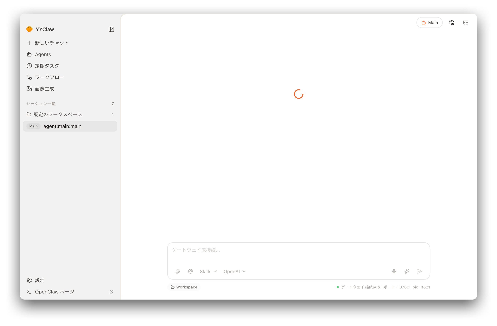
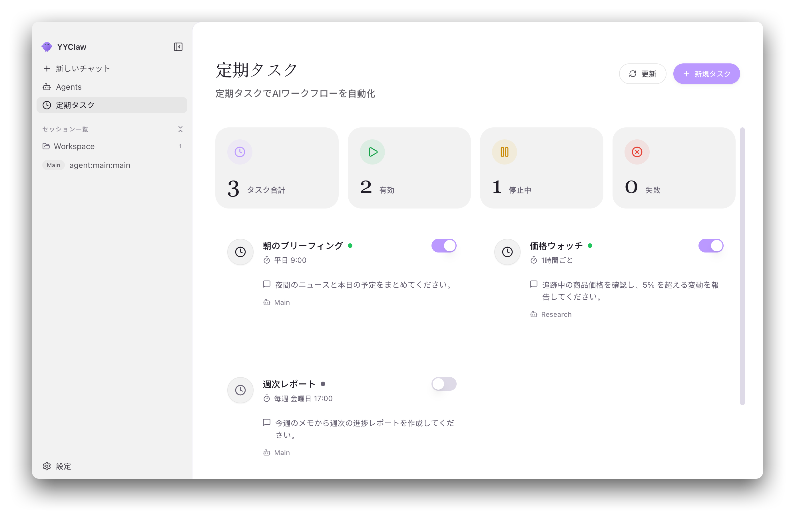
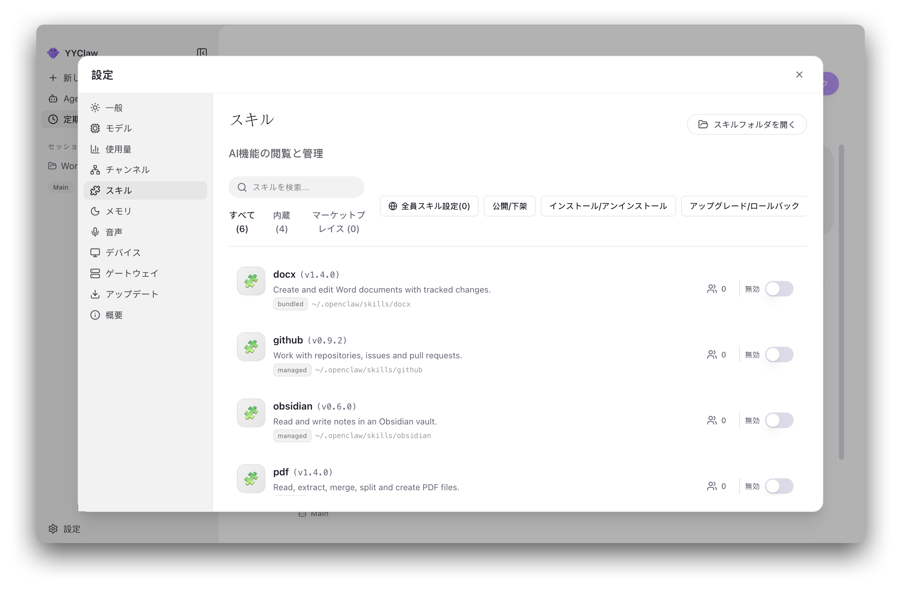
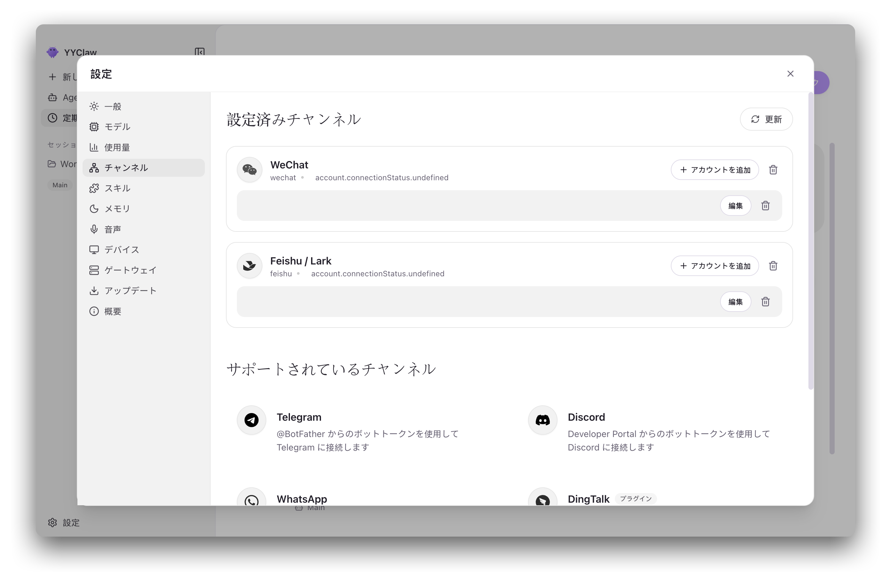
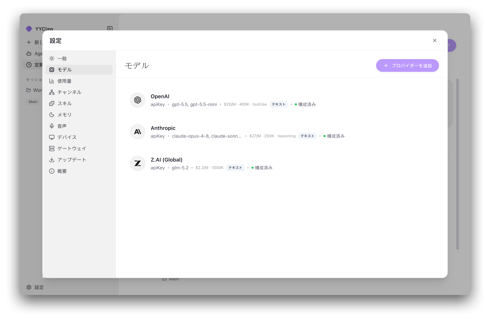
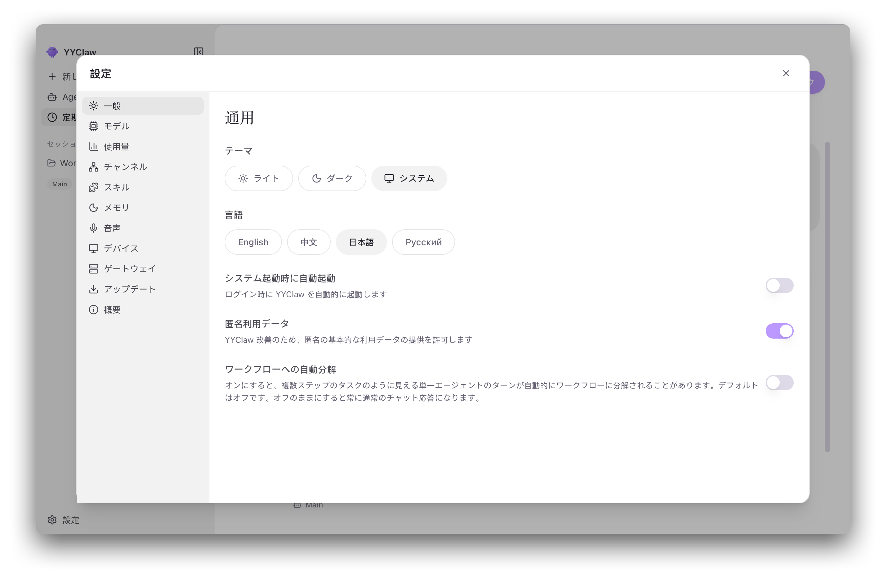

<p align="center">

画面の製品名は YYClaw のアプリ名翻訳に統一します。紫色の主要ボタンとグラデーションボタンは両テーマで白い文字を使用し、内部識別子と上流リンクは変更しません。

設定 → デバイスに、常時表示され初期状態では無効のコンピューター操作設定を配置します。全幅レイアウト、見出し、パネル、ヘッダーの更新ボタンは他の設定タブに合わせます。記憶ページの翻訳を4言語で登録し、中国語はマージ前の夢境ラベルを維持します。
  
</p>

<h1 align="center">YYClaw</h1>

<p align="center">
  <strong>OpenClaw AI エージェントのためのデスクトップインターフェース</strong>
</p>

<p align="center">
  <a href="#設計目標と理念">設計理念</a> •
  <a href="#機能">機能</a> •
  <a href="#ユースケース">ユースケース</a> •
  <a href="#はじめに">はじめに</a> •
  <a href="#アーキテクチャ">アーキテクチャ</a> •
  <a href="#開発">開発</a> •
  <a href="#コントリビューション">コントリビューション</a>
</p>

<p align="center">
  
  
  
  
</p>

<p align="center">
  <a href="README.md">English</a> | <a href="README.zh-CN.md">简体中文</a> | 日本語 | <a href="README.ru-RU.md">Русский</a>
</p>

---

## 概要

**YYClaw** は、コマンドラインでしか使えなかった
[OpenClaw](https://github.com/OpenClaw) AI エージェントランタイムを、すぐに使える
「バッテリー同梱」のデスクトップ体験に変えるクロスプラットフォームアプリケーションです。
OpenClaw ランタイムは**ローカル Gateway サブプロセスとして内包・管理される**ため、
インストールから最初の対話まで、ターミナルや YAML ファイル、環境変数に触れる必要は
一切ありません。

ひとつのウィンドウから、1 つまたは複数のエージェントとの対話（テキスト・音声・画像）、
メッセージングチャネルをエージェントの窓口にすること、定期実行タスクのスケジューリング、
決定的なマルチステップワークフローの実行、ローカルファーストなスキルのインストールと
切り替え、複数の AI プロバイダー設定（資格情報は OS のキーチェーンに保存）、そして
トークン使用量とランタイムの健全性の確認まで、すべて行えます。

YYClaw はベストプラクティスのプロバイダープリセット、ファーストクラスの Windows 対応、
4 つの UI 言語を備えています。それ以外の設定はすべて
**設定 → 詳細 → 開発者** から利用できます。

ひとことで言えば、**ホスト型オフィスエージェント製品のオープンソース代替**です。
[プロダクトの位置づけ](#プロダクトの位置づけオフィスエージェント領域におけるオープンソースの選択肢)を参照してください。


### 上流機能の統合

入力欄はローカルのアカウント名と会話限定のモデル選択を維持します。ACP コンテキスト使用量は Gateway 状態の左に表示され、新しいランタイム情報を優先します。圧縮状態と埋め込みサブエージェントの状態表示・ライブ更新される読み取り専用の子会話・直接の親会話への復帰は独立したワークフロー表示と共存します。`@agent` は対象エージェントの新しい会話を開始します。

圧縮予約はグローバルな既定の会話モデル変更時だけ再計算します。明示された上限の25%、上限がなければ50,000トークンです。エージェント別指定、メディア枠、起動同期では再計算せず、明示された設定を保持します。

DingTalk は上流公式コネクターを使用し、複数アカウントと任意のワークスペース認証を維持します。Computer Use は上流のローカルドライバーと権限管理を使用します。設定 → バージョン情報から匿名化した診断と明示的に選択した生の会話をローカルZIPへ保存し、自動アップロードしません。

## 設計目標と理念

### プロダクトの位置づけ：オフィスエージェント領域におけるオープンソースの選択肢

YYClaw が取り組むのは、新世代の汎用オフィス／ワークエージェントと同じ課題です。
**WorkBuddy**、**TraeWork**、**Qwen オフィス（千问办公）**、**Claude Cowork**、
**ChatGPT Work** といった製品群がターゲットで、チャットボックスで質問に答えるだけでなく、
ドキュメント・メッセージ・スケジュール・ツールをまたいで実際に仕事をする AI の同僚を
目指しています。

違いは*提供のかたち*です。これらの多くはベンダーがホストし、クローズドなコアの上に
構築され、ベンダー自身のモデルに紐づいています。**YYClaw はオープンソースの
[OpenClaw](https://github.com/OpenClaw) エージェントランタイム上に構築された、
自己完結型のデスクトップアプリケーション**であり、あなた自身が実行し、検証し、拡張し、
所有します。

| | 一般的なホスト型オフィスエージェント | YYClaw |
|---|---|---|
| **提供形態** | ベンダーがホストするサービス | ローカルの Gateway サブプロセスを管理するデスクトップアプリ |
| **コアランタイム** | クローズド、ベンダー自製 | オープンソースの OpenClaw を内包・管理 |
| **データの置き場所** | ベンダーのクラウド | あなたのディスク。資格情報は OS のキーチェーン |
| **モデルの選択** | ベンダー自身のモデルに固定 | 設定した任意のプロバイダー —— OpenAI、Anthropic、Z.AI / GLM、あるいは OpenAI 互換ゲートウェイ |
| **拡張性** | ベンダーが審査したプラグインカタログ | ローカルファーストなスキル、拡張層、チャネルプラグイン。審査待ちなし |
| **プライベート展開** | 多くはエンタープライズ層、または非提供 | プロバイダーカタログとスキルマーケットプレイスを自社サーバーに向けられる |
| **ライセンスと課金** | シート課金のサブスクリプション | MIT —— 監査でき、fork でき、社内配布できる |

この領域の製品はそれぞれ異なり、優れたものも少なくありません。ここでの主張はもっと狭く、
具体的です。同じ水準の能力を、**自分の仕事を他社のクラウドに預けることなく、
単一ベンダーのモデルに縛られることなく**手に入れたいなら、YYClaw がそのための
オープンソースの道筋です。

以下の原則は、すべてこの立場から導かれています。

AI エージェントを構築するために、コマンドラインを習得する必要はないはずです。YYClaw は
ひとつの信念に基づいて設計されています。**強力な技術には、あなたの時間を尊重する
インターフェースがふさわしい。** そこから 6 つの原則が導かれます。

- **設定のハードルをゼロに。** ガイド付きセットアップウィザードとリアルタイム検証付きの
  ビジュアル設定が、手書きの設定ファイルを置き換えます。API キーを 1 つも入れる前から、
  アプリは完全に操作でき、テストもできます。
- **ローカルファーストとプライバシー。** ランタイムは自分のマシン上のローカル Gateway
  であり、シークレットは OS ネイティブのキーチェーンに保存され、クラウドへの必須依存は
  ありません。会話とワークスペースのファイルは、あなたのディスクに留まります。
- **単一で安定したインターフェース。** すべてのバックエンド機能は、ひとつの統一
  クライアント経由でアクセスされます。プロトコルの変化とプロセスの複雑さはこの境界の
  内側に留まるため、下層のランタイムが速く進化しても上層のアプリは揺らぎません。
- **既定で回復力を持つ。** Gateway のライフサイクル、再接続、タイムアウト、バックオフは
  自動的に処理されます。ランタイムの起動中でもウィンドウは開き、使える状態を保ちます
  —— 劣化は可視化され、致命的にはなりません。
- **重要な場所では決定的に。** マルチステップタスクにおいて、制御フローはモデルの裁量では
  なく固定されたコードです。非決定性は「モデルステップ」と明示されたノードに限定され、
  スキーマで制約され、決定的なフォールバック経路を持ちます。
- **フォークせずに拡張できる。** ローカルファーストなスキル、差し込み可能な拡張／
  マーケットプレイス層、エージェント単位のカスタマイズにより、アプリ本体にパッチを
  当てずに機能を追加できます。

これらの目標は理想論ではなく強制されています。レンダラー／メインプロセスの境界、
単一エントリ規則、トランスポートポリシーは ESLint と harness spec で検証されます。
詳細は
[アーキテクチャ不変条件](docs/ARCHITECTURE.md#architecture-invariants)
を参照してください。

## スクリーンショット

<table>
  <tr>
    <td align="center"><br><em>チャット</em></td>
    <td align="center"><br><em>定期実行タスク</em></td>
  </tr>
  <tr>
    <td align="center"><br><em>スキル</em></td>
    <td align="center"><br><em>チャネル</em></td>
  </tr>
  <tr>
    <td align="center"><br><em>モデル</em></td>
    <td align="center"><br><em>設定</em></td>
  </tr>
</table>

## 機能

| 機能 | 概要 |
|------|------|
| **セットアップウィザード** | ガイド付き初期設定：言語、プロバイダー、スキルバンドル、検証 |
| **インテリジェントチャット** | Markdown/LaTeX、`@agent`、`/skill`、モデル選択、成果物対応のマルチエージェントチャット |
| **音声対話** | Talk モードのディクテーションとハンズフリー対話、TTS 読み上げ |
| **マルチエージェント管理** | エージェント単位のモデル、スキル許可リスト、チャネル紐付け、全体設定 |
| **プロバイダーとモデル** | プロバイダー／キー設定とローリングウィンドウのトークン使用量分析 |
| **マルチチャネル** | チャネルアカウント、QR／OAuth 連携、アカウント単位のエージェント紐付け |
| **スキルシステム** | ローカルファーストな閲覧／インストール／有効化、任意のマーケットプレイス |
| **定期実行の自動化** | スケジュール実行される AI タスク、外部配信と実行履歴 |
| **ワークフローエンジン** | XState ベースの決定的マルチステップオーケストレーション |
| **エージェントワークスペース** | エージェントワークスペースのファイルツリー閲覧とプレビュー |
| **画像生成** | 独立した OpenAI 互換の画像生成エンドポイント |
| **OpenClaw Dreams** | `memory-core` の dreaming：状態、日記、メンテナンス |

### 🎯 設定のハードルをゼロに

インストールから最初の AI 対話までを、すべてグラフィカルインターフェースで完了できます。
初回起動時のウィザードが、言語、プロバイダー資格情報（API キーまたはブラウザ OAuth）、
スキルバンドル、検証ステップへと順に案内し、システム言語が対応していれば自動で選択します。
スキップも可能で、完了に Gateway の準備完了は必要ありません。

### 💬 インテリジェントチャット

履歴が永続化される複数セッション、GitHub 風テーブルと KaTeX 数式に対応した Markdown で
描画されるアシスタント応答（ユーザー入力はそのままのテキストを保持）、そして画面を移動
しても続くストリーミング応答。

`@agent` と入力すると別のエージェントを指定できます。YYClaw はデフォルトエージェントを
経由して中継するのではなく、そのエージェントの新しい会話を開始します。
スキルは `/skill` チップとして挿入され、クリックすると `SKILL.md` を読めます。複数の
モデルを設定している場合、モデルセレクターはアカウント名を表示し、現在の会話のモデルだけを変更します。
エージェントの既定モデルは変更せず、Gateway の再起動も不要です。
セッションサイドバーはワークスペース優先で、右パネルにはワークスペース・プレビュー・
変更の 3 つのタブがあり、Markdown、`.docx`、`.pptx`、ローカル HTML の読み取り専用
プレビューを提供します。

### 🎙️ 音声対話

エージェントに話しかけ、その応答を聞けます。すべて OpenClaw カーネルのネイティブな
Talk/TTS Gateway RPC 経由で動作し、追加サービスは不要です。*ディクテーション* は
プッシュトゥトークの音声を入力欄に書き起こして確認できるようにし、*会話* モードは
サーバー側の音声活動検出と割り込みに対応した継続的なハンズフリー対話です。各応答には
🔊 再生ボタンがあり、自動読み上げは最終応答を自動的に読み上げます。内蔵の音声ランタイムは
**OpenAI** と **MiniMax** の 2 つです。

音声は設定によって厳密に制御されます。TTS や文字起こしのプロバイダーが未設定の場合、
コントロールは無効化され、アプリは暗黙のフォールバックではなく呼び出し自体を拒否します。

### 🤖 マルチエージェント管理

複数のエージェントを作成・設定できます。それぞれが独自の `provider/model` の上書き
（未設定のエージェントは全体のデフォルトモデルを継承）、独自の有効スキル許可リスト、
独自に紐付けたチャネルアカウントを持てます。エージェントのワークスペースは既定で分離
されており、より強い隔離は OpenClaw のサンドボックス設定に依存します。

### 🔐 安全なプロバイダー統合

OpenAI、Anthropic、Z.AI / GLM、および OpenAI 互換ゲートウェイに接続でき、資格情報は
OS ネイティブのキーチェーンに保存されます。OpenAI は API キーとブラウザ OAuth の両方に
対応します。キーは保存時に検証され、ゲートウェイが認証以外の理由で `/models` を拒否した
場合は軽量な `/chat/completions` または `/responses` プローブにフォールバックします。
カスタムプロバイダーは、ヘッダーに敏感なエンドポイント向けに独自の `User-Agent` を
設定できます。

モデルページでは、7 日間／30 日間のローリングウィンドウでトークン使用量をモデル別または
時間別に集計したグラフも表示されます。データは OpenClaw のセッション記録から集計されます。

### 📡 マルチチャネル管理

独立した AI チャネルを運用できます。各チャネルは複数アカウント、アカウント単位の
エージェント紐付け、切り替え可能なデフォルトアカウントに対応します。同梱のチャネル
プラグイン —— Tencent 個人向け WeChat、Feishu / Lark、WeCom、Discord、QQ、WhatsApp
—— はアプリ内 QR および OAuth フローに対応します。Feishu アプリの作成時には
クイックコマンドのボットメニュー（`/new`、`/stop`、`/reset`、`/status`、`/compact`）も
自動設定されるため、ユーザーは入力せずタップでセッションを操作できます。

### ⏰ 定期実行による自動化

**繰り返し**（毎時、毎日、平日、毎週、または生の cron 式）または**一度だけ**の
スケジュールで AI タスクを設定します。外部配信はタスクフォーム内で直接設定でき、
送信元アカウントと宛先ターゲットを個別に選択できます。宛先はチャネルのディレクトリや
セッション履歴から自動検出されるため、`jobs.json` を手で編集する必要はありません。
スケジュールされたプロンプトはチャット入力欄と同じインラインの `/skill` 記法に対応し、
各ジョブは実行履歴を保持します。

### 🔀 決定的ワークフローエンジン

手順が明確なタスク向けに、メインプロセス上で決定的オーケストレーションエンジン
（XState v5）が動作します。どのノードが実行され、どの分岐が選ばれ、どのループが
繰り返されるかは**完全に固定**されています。非決定性を持つのは*モデル*ステップと明示的に
マークされたノードのみで、それらは `temperature=0`、zod 検証、上限付きリトライで
制約され、決定的なフォールバック経路を備えます。

各実行はノードごとのトレースを生成し、各ステップを**決定的**または**モデル**として
ラベル付けします。実行状態はバージョン付き JSON スナップショットとして永続化されるため、
クラッシュ後も完了済みステップを再実行せずに再開でき、進捗は UI にリアルタイムで
配信されます。ワークフローへ自動振り分けされたチャットタスクは、進捗ポップオーバー付きの
プロセスメッセージとして会話にインライン表示されます。

### 🧩 拡張可能なスキルシステム

スキルページはローカルファーストです。管理ディレクトリ、同梱スキル、拡張、プラグインの
スキルディレクトリをスキャンし —— 重複バージョンを防ぐためワークスペース、`.agents`、
追加ディレクトリは除外します —— スキルの有効／無効切り替えは Gateway に依存しません。
各スキルは実際のディスク上の場所を表示するので、本物のフォルダを直接開けます。

[`anthropics/skills`](https://github.com/anthropics/skills) のドキュメント処理スキル
（`pdf`、`xlsx`、`docx`、`pptx`）と厳選されたカタログが事前同梱されており、起動時に
管理スキルディレクトリ（既定は `~/.openclaw/skills`）へ配置され、初回インストール時に
有効化されます。プラットフォーム制限のあるスキルは該当環境にのみ配置されます。
管理スキルの置き換えはトランザクショナルで、インストールが失敗すると以前のコピーが
復元されます。

### 🌙 OpenClaw Dreams

OpenClaw `memory-core` の「dreaming」（バックグラウンドのメモリ統合）を管理します。
状態、日記、メンテナンス、有効／無効の切り替えが可能です。動作中の Gateway と、
OpenClaw 側で設定された dreaming プラグインが必要です。

### 🎨 テーマ、ローカライズ、システム統合

ライト、ダーク、またはシステム同期のテーマを温かみのあるパレットで提供し、4 つの UI 言語
（`en` / `zh` / `ja` / `ru`）に対応します。ネイティブ統合には、単一インスタンス保護、
システムトレイ（ウィンドウを閉じるとトレイに格納され、終了はトレイメニューから）、
**設定 → 一般** の**システム起動時に起動**、ネイティブ通知、そしてダウンロードや
インストール前に確認する起動時の更新チェックが含まれます。

> 実装上の注意点や制限を含む完全な機能詳細は
> [docs/ja-JP/features.md](docs/ja-JP/features.md) にあります。

## ユースケース

- **🤖 個人向け AI アシスタント。** 質問への回答、メールの下書き、ドキュメントの要約、
  日常業務の処理を、すっきりしたデスクトップウィンドウから行う汎用エージェント。
  手が離せないときは音声でも使えます。
- **📊 自動モニタリング。** ニュースフィードの監視、価格の追跡、特定イベントの待機を
  スケジュール実行し、結果を実際に読んでいるメッセージングチャネルへ届けます。
- **💼 IM チャネルのデジタル従業員。** エージェントを WeChat、Feishu、WeCom、Discord、
  QQ、WhatsApp のアカウントに紐付け、同僚や顧客が既に使っているツールから直接届くように
  しつつ、設定と監査記録はデスクトップ側に保持します。
- **💻 開発者の生産性。** ワークスペースにアクセスできるエージェントによるコードレビュー、
  ドキュメント生成、反復的な変更 —— 「変更」タブが各ターンで触れたファイルを記録します。
- **🔄 信頼できるマルチステップのパイプライン。** タスクを毎回同じ手順で実行しなければ
  ならない場合、ワークフローエンジンが制御フローを固定し、本当に判断が必要なステップに
  だけモデルを使います。
- **🧠 長期にわたるリサーチ。** 個別のワークスペースとモデルを持つ複数エージェントと、
  dreaming ベースのメモリ統合により、複数セッションにまたがる作業を支えます。

## はじめに

### システム要件

- **OS：** macOS 11+、Windows 10+、または Linux（Ubuntu 20.04+）
- **メモリ：** 最低 4 GB、推奨 8 GB
- **ストレージ：** 1 GB の空きディスク容量

- **Computer Use**：macOS 13以上のx64/arm64、またはWindows 10以上のx64。他の対応プラットフォームでもYYClawは利用できますが、この機能は提供されません

### リリース版のインストール

[Releases](https://github.com/compking2012/YYClaw/releases) ページから、お使いの
プラットフォーム向けのビルドをダウンロードしてください。

> **macOS：** DMG から YYClaw を **/Applications** にコピーして、そこから実行して
> ください。マウントされた DMG やその他の読み取り専用ボリュームから起動すると、
> アプリ内アップデーターがアプリバンドルを置き換えられず、インストール手順が何も
> しないように見えることがあります。

### ソースからビルド

```bash
git clone https://github.com/compking2012/YYClaw.git
cd YYClaw

corepack enable          # 固定された pnpm バージョンを有効化
pnpm run init            # 依存関係のインストールと同梱ランタイムのダウンロード
pnpm dev                 # 開発モードで起動
```

OpenClaw Gateway はポート `18789` で自動起動し、準備完了までおよそ 10〜30 秒かかります。
UI 開発に必須ではありません —— アプリは「接続中」状態を表示し、使用可能なままです。

### 初回起動

**セットアップウィザード**が 4 つのステップを案内します。

1. **言語と地域** —— システム言語が対応していれば自動選択、そうでなければ英語
2. **AI プロバイダー** —— API キーで追加、または対応プロバイダーではブラウザ／
   デバイス OAuth で追加
3. **スキルバンドル** —— よくあるユースケース向けの事前設定済みスキルを選択
4. **検証** —— メイン画面に入る前に設定をテスト

### ローカルのコンピューター操作

対応する macOS と Windows では、設定で Computer Use を明示的に有効にし、必要なシステム権限を許可します。同梱ドライバーは Electron Main の監督下でローカル実行され、非公開の `CLAWX_CUA_CONNECTION_FILE` 記述子が OpenClaw に渡されます。実行時ダウンロードや外部ペアリングは不要です。設定を無効にするとドライバーが停止します。

### プロキシ設定

Electron、Gateway、またはチャネルがローカルプロキシを必要とする環境では、
**設定 → Gateway → プロキシ** を開いて既定のプロキシとバイパス規則、さらに
開発者モードでの HTTP、HTTPS、`ALL_PROXY` / SOCKS の任意の上書きを設定します。
`host:port` のみの指定は HTTP として扱われます。ローカルでの典型的な値は
`http://127.0.0.1:7890` です。保存すると Electron のネットワーク設定が即座に再適用され、
Gateway が再起動します。

> プロキシのフォールバック挙動、Telegram との同期、**OpenClaw Doctor** については
> [docs/ja-JP/proxy-settings.md](docs/ja-JP/proxy-settings.md) を参照してください。

## アーキテクチャ

YYClaw は、**管理された OpenClaw Gateway サブプロセスの前面に立つデュアルプロセスの
Electron アプリ**です。レンダラーはネットワークやファイルシステムに直接触れることはなく、
すべてのバックエンドアクセスは、トランスポートポリシーをメインプロセスが所有する
ひとつの統一クライアントを経由します。

```
┌──────────────────────────────────────────────────────────────────┐
│                       YYClaw Desktop App                         │
│                                                                  │
│  ┌────────────────────────────────────────────────────────────┐  │
│  │  Electron Main Process                                     │  │
│  │  • ウィンドウとアプリのライフサイクル                      │  │
│  │  • Gateway プロセスの管理とヘルスチェック                  │  │
│  │  • システム統合（トレイ、通知、キーチェーン）              │  │
│  │  • トランスポートポリシー所有: WS -> HTTP -> IPC           │  │
│  │  • ACP stdio ブリッジ · ワークフロー · 自動更新            │  │
│  └────────────────────────────────────────────────────────────┘  │
│                            ▲                                     │
│    preload contextBridge 許可リスト経由の型付き IPC              │
│                            ▼                                     │
│  ┌────────────────────────────────────────────────────────────┐  │
│  │  React Renderer Process                                    │  │
│  │  • React 19 UI · Zustand ストア                            │  │
│  │  • 単一エントリ: host-api.ts + host-api-client.ts          │  │
│  │  • Node.js を import せず localhost へ直接 fetch しない    │  │
│  └────────────────────────────────────────────────────────────┘  │
└──────────────────────────────────────────────────────────────────┘
                             │
                             │ メインプロセスが所有する WebSocket / HTTP
                             ▼            (127.0.0.1:18789)
┌──────────────────────────────────────────────────────────────────┐
│              OpenClaw Gateway（サブプロセス）                    │
│                                                                  │
│  • AI エージェントランタイムとオーケストレーション               │
│  • メッセージチャネル管理                                        │
│  • スキル／プラグイン実行環境                                    │
│  • プロバイダー抽象化レイヤー                                    │
└──────────────────────────────────────────────────────────────────┘
```

- **ローカルComputer Use**：Electron Main は `EmbeddedCuaDriverHost`、ネイティブ SDK の読み込み、権限確認、daemon の監督を維持します。`CLAWX_CUA_CONNECTION_FILE` は非公開の記述子 `{ v: 2, generation, driverVersion, binaryPath, socketPath }` を指します。OpenClaw の既存の `exec` が同梱バイナリの絶対パスと明示的な socket で CLI を呼び出し、`read` がモデルへ画像を渡します。独自プラグイン、MCP プロキシ、node host、ペアリング、実行時ダウンロードは使用しません。

### アーキテクチャの特徴

- **プロセス分離。** AI ランタイムは別プロセスなので、重い計算中も UI は応答性を保ち、
  ランタイムのクラッシュがウィンドウを巻き込むことはありません。
- **フロントエンドの単一エントリ。** レンダラーのバックエンドアクセスはすべて
  [`src/lib/host-api.ts`](src/lib/host-api.ts) と
  [`src/lib/host-api-client.ts`](src/lib/host-api-client.ts) を経由します。ページやコンポーネントが
  直接 IPC を呼ぶことはありません。
- **メインプロセスがトランスポートを所有。** トランスポートポリシーは
  `WS → HTTP → IPC` のフォールバックに固定され、メインプロセスが所有します。
  レンダラーはプロトコル切り替えのロジックを一切実装しません。
- **preload が唯一のブリッジ。** レンダラーは Node.js モジュールを import せず、
  preload の `contextBridge` 許可リストが唯一の接点です。
- **設計上 CORS に安全。** レンダラーはローカル Gateway や Host API の HTTP
  エンドポイントを直接呼ばず、メインプロセスのプロキシチャネル経由にします。
- **ACP ベースのチャット。** チャットはメインプロセスが所有する stdio ブリッジを通じて
  [ACP（Agent Client Protocol）](https://agentclientprotocol.com) で OpenClaw と通信し、
  速く進化するランタイムの前に比較的安定したプロトコル面を提供します。認証付きの履歴
  リプレイと、画面移動後も続くストリーミングに対応します。
- **設定のホット適用。** 通常のプロバイダー、エージェント、スキル、モデルの変更は
  Gateway プロセスを置き換えずに適用されます。資格情報はホットリロードされ、保護された
  復旧処理はハートビートが繰り返し失われた後にのみ開始します。
- **Gateway の単一所有。** `127.0.0.1:18789` を待ち受けられるのは 1 プロセスのみです。
- **安全な保存。** API キーと機密データは OS ネイティブのセキュアストレージを使用します。

> レイヤー図、3 層通信モデル、ACP ファイルアクティビティのセマンティクス、設定の配信、
> Gateway のトラブルシューティングは
> [docs/ja-JP/architecture.md](docs/ja-JP/architecture.md) と
> [docs/ARCHITECTURE.md](docs/ARCHITECTURE.md) で扱っています。

## 開発

### 前提条件

- **Node.js** 22.22.3+、24.15.0+、または 25.9.0+（対応するメジャーライン内。
  Node 24 LTS 推奨）
- **pnpm**（`package.json` の `packageManager` フィールドで固定）。
  `corepack enable` を実行すると正しいバージョンが有効になります。
  **npm と yarn は非対応です。**
- **Linux（Ubuntu/Debian）：** Electron を実行する前に必要なシステムライブラリを
  インストールしてください —— [docs/ja-JP/development.md](docs/ja-JP/development.md) を参照

### プロジェクト構成

```
YYClaw/
├── electron/                # Electron メインプロセス
│   ├── main/                # アプリのエントリ、ウィンドウ、IPC 登録
│   ├── preload/             # 安全な contextBridge IPC ブリッジ
│   ├── api/                 # メイン側の型付き API ルーター
│   ├── gateway/             # OpenClaw Gateway プロセスマネージャー
│   ├── workflow/            # XState 決定的ワークフローエンジン
│   ├── extensions/          # メインプロセスの拡張コントリビューション
│   ├── services/            # プロバイダー、シークレット、ランタイムサービス
│   └── utils/               # ストレージ、認証、パス、テレメトリ
├── src/                     # React レンダラープロセス
│   ├── lib/                 # 統一フロントエンド API とエラーモデル
│   ├── stores/              # Zustand ストア（設定／チャット／gateway）
│   ├── components/          # 再利用可能な UI コンポーネント
│   ├── pages/               # Chat、Agents、Channels、Cron、Workflows、
│   │                        # Skills、Models、Settings、Setup、Dreams、
│   │                        # ImageGeneration、Login
│   └── styles/              # デザイントークンとグローバル CSS
├── shared/                  # プロセス間の契約と i18n ロケール
├── harness/                 # spec 駆動の AI コーディング検証 harness
├── docs/                    # アーキテクチャ、プロダクト、各言語ドキュメント
├── tests/
│   ├── unit/                # Vitest のユニット／統合テスト
│   └── e2e/                 # Playwright Electron の E2E テスト
├── resources/               # アイコン、スクリーンショット、同梱バイナリ
└── scripts/                 # ビルド、バンドル、ユーティリティスクリプト
```

### よく使うコマンド

```bash
pnpm run init        # 依存関係のインストールと同梱ランタイムのダウンロード
pnpm dev             # ホットリロード付きの開発モードで起動
pnpm lint            # ESLint を自動修正付きで実行
pnpm typecheck       # TypeScript 検証（node + web の両プロジェクト）
pnpm test            # ユニットテストを実行（Vitest）
pnpm run test:e2e    # Electron E2E テストを実行（Playwright）
pnpm build           # 本番ビルド一式
pnpm package         # 現在のプラットフォーム向けにパッケージ（:mac / :win / :linux）
```

ヘッドレス Linux では、`xvfb-run -a pnpm run test:e2e` のようにディスプレイサーバー上で
Electron テストを実行してください。

> macOS で Linux の `.deb` をビルドするには GNU tar と GNU ar が必要です
> （`brew install gnu-tar binutils`）。これらがないと同梱の `fpm` は無効な 96 バイトの
> `.deb` を黙って生成しながら成功を報告します。現在は `pnpm package:linux` が
> どちらか欠けていれば即座に失敗します。

通信経路 —— gateway イベント、ACP チャットブリッジ、チャネル配信、トランスポートの
フォールバック —— に触れる変更では、リグレッションチェックを実行してください。

```bash
pnpm run comms:replay
pnpm run comms:compare
```

### 技術スタック

| レイヤー | 技術 |
|----------|------|
| ランタイム | Electron 40 |
| UI | React 19 + TypeScript 5.9 |
| スタイリング | Tailwind CSS 3.4 + shadcn/ui（Radix UI） |
| 状態管理 | Zustand 5 |
| オーケストレーション | XState 5 |
| ビルド | Vite 7 + electron-builder 26 |
| テスト | Vitest 4 + Playwright |
| アニメーション | Framer Motion |
| アイコン | Lucide React |
| 数式／エディタ | KaTeX · Monaco Editor |

> エディタのセットアップ、パフォーマンスプロファイリング、E2E の詳細は
> [docs/ja-JP/development.md](docs/ja-JP/development.md) にあります。

## コントリビューション

バグ修正、機能追加、ドキュメント、翻訳など、あらゆるコントリビューションを歓迎します。

1. リポジトリを **Fork**
2. 機能ブランチを**作成**（`git checkout -b feature/amazing-feature`）
3. 明確なメッセージで変更を**コミット**
4. ブランチに **Push**
5. プルリクエストを**作成**

PR を開く前に、次を確認してください。

- `pnpm lint`、`pnpm typecheck`、`pnpm test` がすべて通ること
- ユーザーに見える UI 変更は、同じ PR で Playwright E2E spec を追加または更新すること
- 新しいユーザー向け文字列は `react-i18next` 経由にし、4 つのロケール
  （`en` / `zh` / `ja` / `ru`）すべてをカバーすること
- 通信経路の変更は `pnpm run comms:replay` と `pnpm run comms:compare` を通過すること
- 挙動、フロー、インターフェースの変更は、同じ PR で該当ドキュメントを更新すること

プロジェクトの規約は [AGENTS.md](AGENTS.md) と
[docs/TROUBLESHOOTING.md](docs/TROUBLESHOOTING.md) にあります。
[行動規範](CODE_OF_CONDUCT.md) と[セキュリティポリシー](SECURITY.md) もお読みください。

## 謝辞

YYClaw は [ValueCell](https://valuecell.ai) チームによる **ClawX** から派生しています。
本プロジェクトの土台となったその成果に感謝します。

また、数々の優れたオープンソースプロジェクトの上に成り立っています。

- [OpenClaw](https://github.com/OpenClaw) —— 中核となる AI エージェントランタイム
- [Electron](https://www.electronjs.org/) —— クロスプラットフォームのデスクトップ
  フレームワーク
- [React](https://react.dev/) —— UI ライブラリ
- [Vite](https://vite.dev/) —— ビルドツール
- [Tailwind CSS](https://tailwindcss.com/)、[shadcn/ui](https://ui.shadcn.com/)、
  [Radix UI](https://www.radix-ui.com/) —— スタイリングとアクセシブルな基本部品
- [Zustand](https://github.com/pmndrs/zustand) —— 軽量な状態管理
- [XState](https://stately.ai/docs) —— 決定的ワークフローエンジン
- [Framer Motion](https://motion.dev/) と [Lucide](https://lucide.dev/) ——
  アニメーションとアイコン
- [KaTeX](https://katex.org/) と
  [Monaco Editor](https://microsoft.github.io/monaco-editor/) —— 数式とコードの描画
- [Vitest](https://vitest.dev/) と [Playwright](https://playwright.dev/) —— テスト
- [electron-builder](https://www.electron.build/) と
  [electron-updater](https://www.electron.build/auto-update) ——
  パッケージングと更新
- [anthropics/skills](https://github.com/anthropics/skills) —— 同梱のドキュメント処理
  スキル
- チャネルプラグインの作者の皆さん：Tencent（WeChat、QQ）、Lark/Feishu、WeCom、
  および OpenClaw プラグインエコシステム（Discord、WhatsApp）

## ライセンス

YYClaw は [MIT ライセンス](LICENSE) の下で公開されています。本ソフトウェアは自由に
使用、改変、配布できます。
