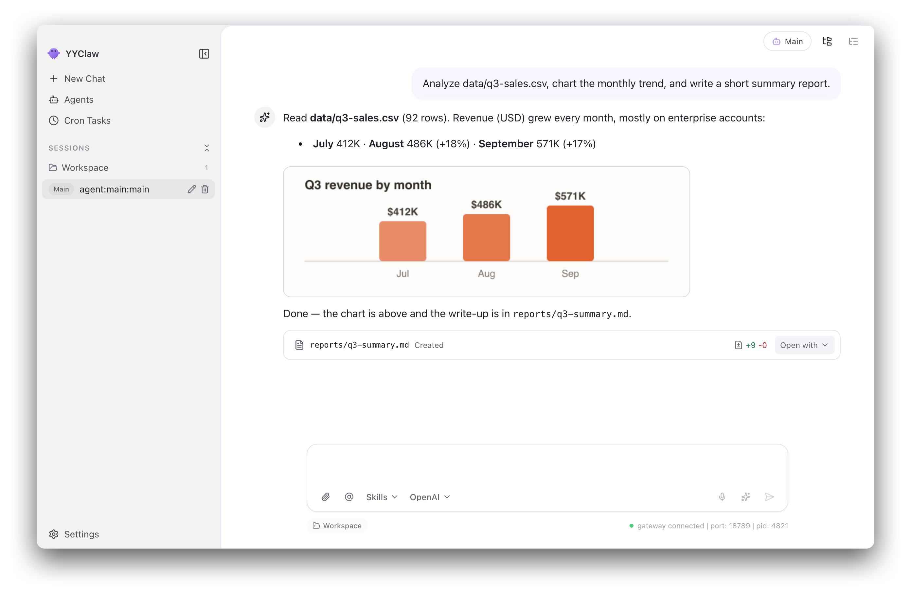
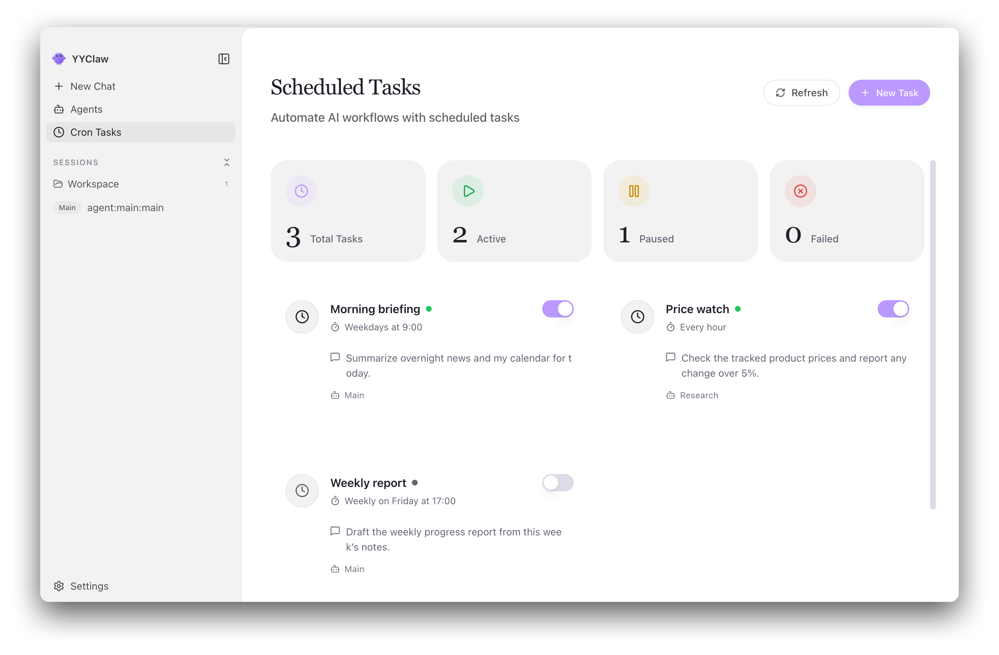
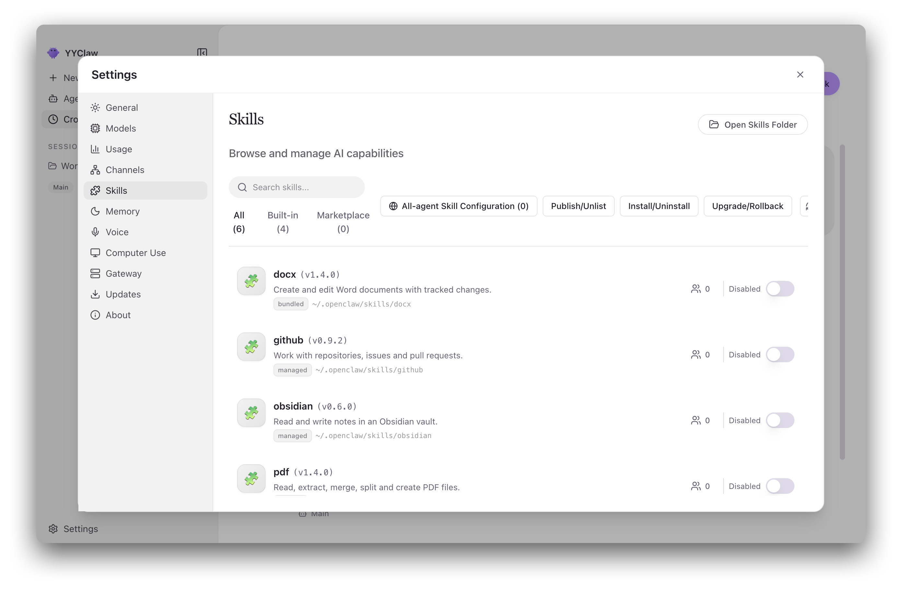
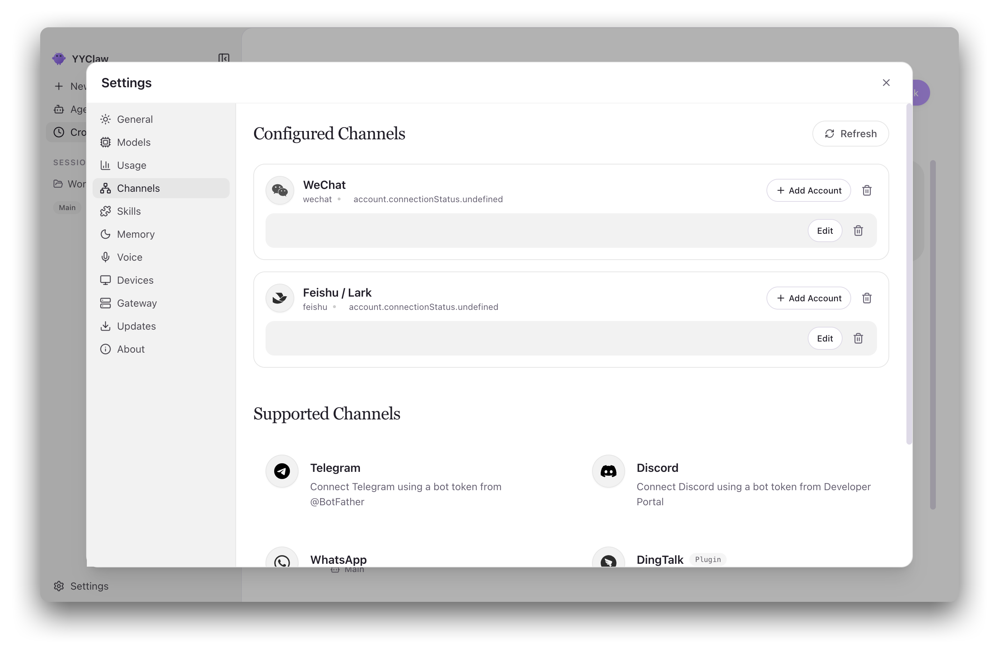
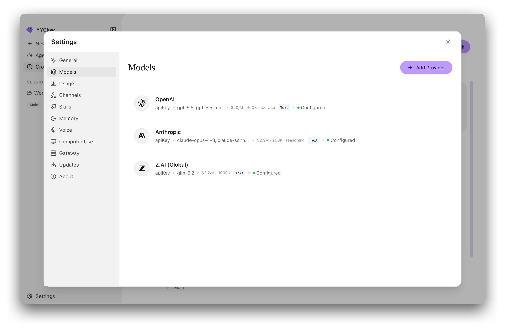
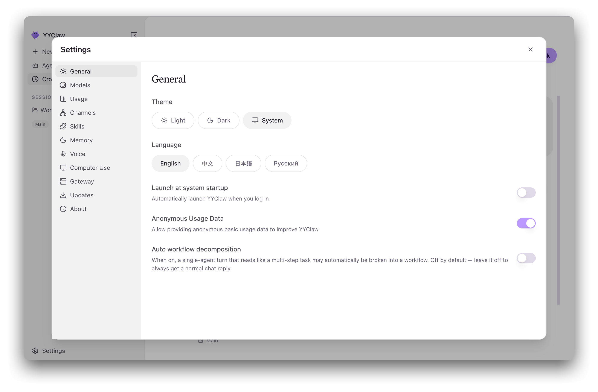

<p align="center">
  
</p>

<h1 align="center">YYClaw</h1>

<p align="center">
  <strong>The Desktop Interface for OpenClaw AI Agents</strong>
</p>

<p align="center">
  <a href="#design-goals-and-philosophy">Philosophy</a> •
  <a href="#features">Features</a> •
  <a href="#use-cases">Use Cases</a> •
  <a href="#getting-started">Getting Started</a> •
  <a href="#architecture">Architecture</a> •
  <a href="#development">Development</a> •
  <a href="#contributing">Contributing</a>
</p>

<p align="center">
  
  
  
  
</p>

<p align="center">
  English | <a href="README.zh-CN.md">简体中文</a> | <a href="README.ja-JP.md">日本語</a> | <a href="README.ru-RU.md">Русский</a>
</p>

---

## Overview

**YYClaw** is a cross-platform desktop application that turns the command-line
[OpenClaw](https://github.com/OpenClaw) AI agent runtime into an accessible,
"battery-included" experience. The OpenClaw runtime is **embedded and supervised
as a local Gateway subprocess**, so you never touch a terminal, a YAML file, or an
environment variable to get from installation to your first AI conversation.

From a single window you can chat with one or more agents (text, voice, and
images), turn instant-messaging channels into agent front-ends, schedule recurring
automated tasks, run deterministic multi-step workflows, install and toggle
local-first skills, configure multiple AI providers with credentials in your OS
keychain, and watch your token usage and runtime health.

YYClaw ships with best-practice provider presets, first-class Windows support, and
four UI languages. Use Settings for everyday configuration and
**Settings → Advanced → Developer** for debugging tools.

It is, in short, an **open-source alternative to hosted office-agent products** —
see [Positioning](#positioning-the-open-source-option-in-the-office-agent-category).

## Design Goals and Philosophy

### Positioning: the open-source option in the office-agent category

YYClaw goes after the same job as the new generation of general-purpose office and
work agents — **WorkBuddy**, **TraeWork**, **Qwen Office (千问办公)**,
**Claude Cowork**, **ChatGPT Work**, and others in that category: an AI teammate
that does real work across your documents, messages, schedules, and tools instead
of just answering questions in a chat box.

What differs is *how it is delivered*. Those offerings are typically
vendor-hosted, built on a closed core, and tied to the vendor's own models.
**YYClaw is a self-contained desktop application built on the open-source
[OpenClaw](https://github.com/OpenClaw) agent runtime** — which you run, inspect,
extend, and own.

| | Typical hosted office agent | YYClaw |
|---|---|---|
| **Delivery** | Vendor-hosted service | Desktop app supervising a local Gateway subprocess on your machine |
| **Core runtime** | Closed, vendor-built | Open-source OpenClaw, embedded and supervised |
| **Where data lives** | The vendor's cloud | Your disk; credentials in the OS keychain |
| **Model choice** | Bound to the vendor's own models | Any provider you configure — OpenAI, Anthropic, Z.AI / GLM, or any OpenAI-compatible gateway |
| **Extensibility** | Vendor-curated plugin catalog | Local-first skills, extension layer, channel plugins — no approval loop |
| **Private deployment** | Usually enterprise-tier, or unavailable | Point the provider catalog and skill marketplace at your own server |
| **Licensing** | Per-seat subscription | MIT — audit it, fork it, ship it internally |

Products in that category differ from one another, and several are genuinely good.
The claim here is narrower and specific: if you want that class of capability
**without handing your work to someone else's cloud, and without being locked to a
single vendor's model**, YYClaw is the open-source path to it.

Everything below follows from that stance.

Building AI agents shouldn't require mastering a command line. YYClaw is designed
around one conviction: **powerful technology deserves an interface that respects
your time.** Six principles follow from it.

- **Zero configuration barrier.** A guided setup wizard and visual settings with
  real-time validation replace hand-edited config files. The app is fully
  navigable — and testable — before you add a single API key.
- **Local-first and private.** The runtime is a local Gateway on your machine,
  secrets live in the native OS keychain, and there is no mandatory cloud
  dependency. Your conversations and workspace files stay on your disk.
- **One stable interface.** Every backend capability is reached through a single
  unified client. Protocol churn and process complexity stay behind that
  boundary, so a fast-moving runtime underneath doesn't destabilize the app on top.
- **Resilient by default.** Gateway lifecycle, reconnect, timeout, and backoff are
  handled automatically. The window opens and stays usable while the runtime is
  still starting — degradation is visible, never fatal.
- **Determinism where it matters.** For multi-step tasks, control flow is fixed
  code, not a model's discretion. Non-determinism is confined to nodes explicitly
  marked as model steps, constrained by a schema, and given a deterministic
  fallback.
- **Extensible without forking.** Local-first skills, a pluggable
  extension/marketplace layer, and per-agent customization mean you can add
  capability without patching the app.

These goals are enforced, not aspirational: the renderer/main boundary, the
single-entry rule, and the transport policy are checked by ESLint and the harness
specs. See [Architecture Invariants](docs/ARCHITECTURE.md#architecture-invariants).

## Screenshots

<table>
  <tr>
    <td align="center"><br><em>Chat</em></td>
    <td align="center"><br><em>Scheduled tasks</em></td>
  </tr>
  <tr>
    <td align="center"><br><em>Skills</em></td>
    <td align="center"><br><em>Channels</em></td>
  </tr>
  <tr>
    <td align="center"><br><em>Models</em></td>
    <td align="center"><br><em>Settings</em></td>
  </tr>
</table>

## Features

| Feature | Summary |
|---------|---------|
| **Setup Wizard** | Guided onboarding: language, providers, skill bundles, verification |
| **Intelligent Chat** | Multi-agent chat with Markdown/LaTeX, `@agent`, `/skill`, model picker, artifacts |
| **Voice Interaction** | Talk-mode dictation and hands-free conversation, plus TTS playback |
| **Multi-Agent Management** | Per-agent model, skill allowlist, channel binding, global config |
| **Providers & Models** | Provider/key configuration plus rolling token-usage analytics |
| **Multi-Channel** | Channel accounts, QR/OAuth linking, per-account agent binding |
| **Skill System** | Local-first browse / install / enable-disable, optional marketplaces |
| **Cron Automation** | Scheduled AI tasks with external delivery and run history |
| **Workflow Engine** | Deterministic XState-based multi-step orchestration |
| **Agent Workspace** | File-tree browser and preview of the agent workspace |
| **Image Generation** | Dedicated OpenAI-compatible image endpoint |
| **OpenClaw Dreams** | `memory-core` dreaming: status, diary, maintenance |
| **Computer Use** | Opt-in local operation in Settings → Devices, controlled by system permissions |
| **Diagnostics & Support** | Redacted diagnostic exports, optional transcripts, no automatic upload |

### 🎯 Zero Configuration Barrier

Complete the entire setup — installation to first AI interaction — through a
graphical interface. The first-launch wizard walks you through language, provider
credentials (API key or browser OAuth), skill bundles, and a verification step,
preselecting your system language when it's supported. You can skip it; Gateway
readiness isn't required to finish.

### 💬 Intelligent Chat

Multiple sessions with persisted history, assistant replies rendered as Markdown
with GitHub-flavored tables and KaTeX math (user input stays literal text), and
streaming responses that keep running when you navigate away.

Type `@agent` to target another agent — YYClaw starts a fresh conversation for that
agent instead of relaying through the default agent. Insert skills
as `/skill` chips and click one to read its `SKILL.md`. When several models are
configured, the model picker shows account names and overrides only the current
conversation's model, without changing agent defaults or restarting Gateway. The session sidebar is workspace-first,
and the right panel offers Workspace, Preview, and Changes tabs with read-only
previews for Markdown, `.docx`, `.pptx`, and local HTML.

The chat interface shows context usage and compaction status so you can track conversation capacity. Subagent tasks provide live status, read-only child conversations, and navigation back to the parent conversation. Workflow tasks have their own progress timeline.

### 🎙️ Voice Interaction

Talk to your agents and hear them reply, entirely through the OpenClaw kernel's
native Talk/TTS Gateway RPCs — no extra services. *Dictation* transcribes
push-to-talk speech into the composer for review; *Conversation* mode is a
continuous hands-free dialog with server-side voice activity detection and
barge-in. Each reply gets a 🔊 play button, and auto-read can speak final replies
automatically. Two built-in voice runtimes ship: **OpenAI** and **MiniMax**.

Voice is strictly config-gated — with no TTS or transcription provider set, the
controls are disabled and the app refuses the calls rather than silently falling
back.

### 🤖 Multi-Agent Management

Create and configure multiple agents, each with its own `provider/model` override
(agents without one inherit the global default), its own enabled-skill allowlist,
and its own bound channel accounts. Agent workspaces are separate by default;
stronger isolation depends on OpenClaw sandbox settings.

### 🔐 Secure Provider Integration

Connect OpenAI, Anthropic, Z.AI / GLM, and OpenAI-compatible gateways, with
credentials stored in your system's native keychain. OpenAI supports both API key
and browser OAuth. Keys are validated on save, falling back to a lightweight
`/chat/completions` or `/responses` probe when a gateway rejects `/models` for
non-auth reasons. Custom providers can set their own `User-Agent` for
compatibility-sensitive endpoints.

The Models page also charts token usage over rolling 7-day and 30-day windows,
grouped by model or by time, aggregated from OpenClaw session transcripts.

### 📡 Multi-Channel Management

Run independent AI channels, each with multiple accounts, per-account agent
binding, and a switchable default account. In-app QR and OAuth flows cover the
bundled channel plugins — Tencent personal WeChat, Feishu/Lark, WeCom, Discord,
QQ, and WhatsApp. Feishu app creation also auto-configures a Quick Commands bot
menu (`/new`, `/stop`, `/reset`, `/status`, `/compact`) so users can drive session
control by tapping instead of typing.

DingTalk supports multiple accounts and optional workspace authorization.

### ⏰ Cron-Based Automation

Schedule AI tasks on **Recurring** (hourly, daily, weekdays, weekly, or raw cron)
or **Once** schedules. Configure external delivery in the task form itself, with
separate sender-account and recipient-target selectors — recipients are
auto-discovered from channel directories or session history, so there is no
`jobs.json` to hand-edit. Scheduled prompts support the same inline `/skill`
tokens as the chat composer, and each job keeps a run history.

### 🔀 Deterministic Workflow Engine

For tasks with clearly defined steps, a deterministic orchestration engine
(XState v5) runs in the main process. Which node runs, which branch is taken, and
which loop repeats is **100% fixed**; only nodes explicitly marked as *model*
steps carry non-determinism, and those are constrained with `temperature=0`, zod
validation, and bounded retries, with a deterministic fallback path.

Every run produces a per-node trace labeling each step **deterministic** or
**model**, persists as versioned JSON snapshots so a crash resumes without
re-running completed steps, and streams live progress to the UI. Chat tasks that
auto-route to a workflow appear inline in the conversation as a process message
with a progress popover.

### 🧩 Extensible Skill System

- **Manage skills:** Use **Settings → Skills** to browse, install, uninstall, manage versions, and publish to marketplaces. Installing a skill does not assign it to an agent.
- **Configure agents:** In **Agent → Settings → Skills**, choose the default plan or an independent configuration. The default plan stays synchronized with inheriting agents; an independent plan affects only that agent, and an empty plan uses no skills.
- **Add and adjust:** Search and select multiple skills to add. In use cards offer descriptions, pause, and remove actions. Expand Paused to resume skills, or enter selection mode for batch operations.
- **Save or cancel:** Edits stay in a draft until you save. Cancel leaves the configuration unchanged; a failed save keeps the draft available for retry.
- **Uninstall safely:** Pausing keeps the association, while removing an association does not uninstall the skill. Remove all agent and default-plan associations before uninstalling. Agent skill selections do not automatically enable disabled skill assets.

The Skills page is local-first: it scans managed, bundled, extension, and plugin
skill directories — excluding workspace, `.agents`, and extra directories to
prevent duplicate versions. Asset management does not assign skills to agents.
Each skill shows its real on-disk location so you can open the actual
folder.

Document-processing skills (`pdf`, `xlsx`, `docx`, `pptx`) from
[`anthropics/skills`](https://github.com/anthropics/skills) plus a curated catalog
are pre-bundled, deployed to the managed skills directory (default
`~/.openclaw/skills`) on startup, and enabled on first install.
Platform-restricted skills are only deployed where they apply. Replacing a
managed skill is transactional — a failed install restores the previous copy.

### 🌙 OpenClaw Dreams

Manage OpenClaw `memory-core` "dreaming" — background memory consolidation —
including status, diary, maintenance, and enable/disable. Requires a running
Gateway and the dreaming plugin configured on the OpenClaw side.

### 🎨 Theming, Localization & System Integration

Light, dark, or system-synchronized themes on a warm palette, with four UI
languages (`en` / `zh` / `ja` / `ru`). Native integration covers single-instance
protection, a system tray (closing the window hides to tray; quit from the tray
menu), **Launch at system startup** in Settings → General, native notifications,
and startup update checks that prompt before downloading or installing.

> Full feature detail, including implementation caveats and limits, lives in
> [docs/en-US/features.md](docs/en-US/features.md).

### 🛠️ Diagnostics and Support

Use **Settings → About** to export a local diagnostic ZIP for troubleshooting or support. Diagnostics are redacted; raw conversation transcripts are included only when you explicitly select them. Exported files are not uploaded automatically.

## Use Cases

- **🤖 Personal AI assistant.** A general-purpose agent that answers questions,
  drafts email, summarizes documents, and handles everyday tasks from a clean
  desktop window — with voice when your hands are busy.
- **📊 Automated monitoring.** Scheduled agents that watch news feeds, track
  prices, or wait for specific events, delivering results to the messaging channel
  you actually read.
- **💼 IM-channel digital worker.** Bind an agent to a WeChat, Feishu, WeCom,
  Discord, QQ, or WhatsApp account and let colleagues or customers reach it where
  they already are, while you keep the configuration and audit trail on your
  desktop.
- **💻 Developer productivity.** Agents with workspace access for code review,
  documentation generation, and repetitive changes — with a Changes tab recording
  the files each turn touched.
- **🔄 Reliable multi-step pipelines.** When a task must run the same way every
  time, the workflow engine fixes the control flow and confines model judgment to
  the steps that genuinely need it.
- **🧠 Long-running research.** Multiple agents with separate workspaces, per-agent
  models, and dreaming-based memory consolidation for work that spans sessions.

## Getting Started

### System Requirements

- **Operating system:** macOS 11+, Windows 10+, or Linux (Ubuntu 20.04+)
- **Memory:** 4 GB RAM minimum, 8 GB recommended
- **Storage:** 1 GB available disk space

- **Computer Use**: macOS 13+ on x64/arm64, or Windows 10+ on x64; other supported YYClaw platforms continue to work without this feature

### Install a Release

Download the build for your platform from the
[Releases](https://github.com/compking2012/YYClaw/releases) page.

> **macOS:** copy YYClaw into **/Applications** from the DMG and run it there. If
> you launch it from the mounted DMG or another read-only volume, the in-app
> updater cannot replace the app bundle and the install step may appear to do
> nothing.

### Build from Source

```bash
git clone https://github.com/compking2012/YYClaw.git
cd YYClaw

corepack enable          # activate the pinned pnpm version
pnpm run init            # install dependencies and download bundled runtimes
pnpm dev                 # start in development mode
```

The OpenClaw Gateway starts automatically on port `18789` and takes roughly
10–30 seconds to become ready. It is not required for UI work — the app shows a
"connecting" state and stays usable.

### First Launch

The **Setup Wizard** guides you through four steps:

1. **Language & region** — preselects your system language when supported, English
   otherwise
2. **AI provider** — add providers by API key, or by browser/device OAuth where
   supported
3. **Skill bundles** — pick pre-configured skills for common use cases
4. **Verification** — test the configuration before entering the main interface

### Local Computer Use

On supported macOS and Windows systems, open **Settings → Devices**, enable Computer Use, and grant the requested system permissions. This entry is available without developer mode, and the feature is off by default. The driver runs locally without additional downloads or external pairing; disabling the feature stops it.

### Proxy Settings

For environments where Electron, the Gateway, or a channel needs a local proxy,
open **Settings → Gateway → Proxy** to set the default proxy and bypass rules,
plus optional developer-mode overrides for HTTP, HTTPS, and `ALL_PROXY` / SOCKS.
A bare `host:port` is treated as HTTP; a typical local value is
`http://127.0.0.1:7890`. Saving reapplies Electron networking immediately and
restarts the Gateway.

> Proxy fallback behavior, Telegram synchronization, and **OpenClaw Doctor** are
> documented in [docs/en-US/proxy-settings.md](docs/en-US/proxy-settings.md).

## Architecture

YYClaw is a **dual-process Electron app fronting a supervised OpenClaw Gateway
subprocess**. The renderer never touches the network or filesystem directly; all
backend access flows through one unified client whose transport policy is owned by
the main process.

```
┌──────────────────────────────────────────────────────────────────┐
│                       YYClaw Desktop App                         │
│                                                                  │
│  ┌────────────────────────────────────────────────────────────┐  │
│  │  Electron Main Process                                     │  │
│  │  • Window & application lifecycle                          │  │
│  │  • Gateway process supervision & health                    │  │
│  │  • System integration (tray, notifications, keychain)      │  │
│  │  • Transport policy owner: WS -> HTTP -> IPC               │  │
│  │  • ACP stdio bridge · workflow engine · auto-update        │  │
│  └────────────────────────────────────────────────────────────┘  │
│                            ▲                                     │
│        typed IPC via the preload contextBridge allowlist         │
│                            ▼                                     │
│  ┌────────────────────────────────────────────────────────────┐  │
│  │  React Renderer Process                                    │  │
│  │  • React 19 UI · Zustand stores                            │  │
│  │  • Single entry: host-api.ts + host-api-client.ts          │  │
│  │  • No Node.js imports, no direct localhost fetch           │  │
│  └────────────────────────────────────────────────────────────┘  │
└──────────────────────────────────────────────────────────────────┘
                             │
                             │ Main-owned WebSocket / HTTP
                             ▼            (127.0.0.1:18789)
┌──────────────────────────────────────────────────────────────────┐
│                 OpenClaw Gateway (subprocess)                    │
│                                                                  │
│  • AI agent runtime and orchestration                            │
│  • Message channel management                                    │
│  • Skill / plugin execution environment                          │
│  • Provider abstraction layer                                    │
└──────────────────────────────────────────────────────────────────┘
```

### Architectural Characteristics

- **Local Computer Use.** Electron Main supervises the bundled driver, checks system permissions, and manages its local lifecycle. The runtime accesses this capability through a local connection.

- **Process isolation.** The AI runtime is a separate process, so the UI stays
  responsive during heavy computation and a runtime crash doesn't take the window
  with it.
- **Single frontend entry.** All renderer backend access goes through
  [`src/lib/host-api.ts`](src/lib/host-api.ts) and
  [`src/lib/host-api-client.ts`](src/lib/host-api-client.ts). No page or component makes a
  direct IPC call.
- **Main-owned transport.** Transport policy is fixed as `WS → HTTP → IPC`
  fallback and owned by the main process; the renderer implements no
  protocol-switching logic.
- **Preload is the only bridge.** The renderer imports no Node.js modules; the
  preload `contextBridge` allowlist is the sole surface.
- **CORS-safe by construction.** The renderer never calls local Gateway or Host API
  HTTP endpoints; those go through Main proxy channels.
- **ACP-based chat.** Chat talks to OpenClaw over
  [ACP (Agent Client Protocol)](https://agentclientprotocol.com) through a
  Main-owned stdio bridge, giving a relatively stable protocol surface in front of
  a fast-iterating runtime, with authenticated history replay and streaming that
  survives navigation.
- **Hot configuration.** Ordinary provider, agent, skill, and model changes apply
  without replacing the Gateway process; credentials hot-reload, and guarded
  recovery starts only after repeated heartbeat misses.
- **Single Gateway owner.** Exactly one process may listen on `127.0.0.1:18789`.
- **Secure storage.** API keys and sensitive data use the operating system's native
  secure storage.

> The layer diagram, three-tier communication model, ACP file-activity semantics,
> configuration delivery, and Gateway troubleshooting are covered in
> [docs/en-US/architecture.md](docs/en-US/architecture.md) and
> [docs/ARCHITECTURE.md](docs/ARCHITECTURE.md).

## Development

### Prerequisites

- **Node.js** 22.22.3+, 24.15.0+, or 25.9.0+ within the matching major line
  (Node 24 LTS recommended)
- **pnpm**, pinned by the `packageManager` field in `package.json`. Run
  `corepack enable` to activate the right version. **npm and yarn are not
  supported.**
- **Linux (Ubuntu/Debian):** install the required system libraries before running
  Electron — see [docs/en-US/development.md](docs/en-US/development.md)

### Project Structure

```
YYClaw/
├── electron/                # Electron main process
│   ├── main/                # App entry, windows, IPC registration
│   ├── preload/             # Secure contextBridge IPC bridge
│   ├── api/                 # Main-side typed API router
│   ├── gateway/             # OpenClaw Gateway process manager
│   ├── workflow/            # XState deterministic workflow engine
│   ├── extensions/          # Main-process extension contributions
│   ├── services/            # Providers, secrets, runtime services
│   └── utils/               # Storage, auth, paths, telemetry
├── src/                     # React renderer process
│   ├── lib/                 # Unified frontend API + error model
│   ├── stores/              # Zustand stores (settings/chat/gateway)
│   ├── components/          # Reusable UI components
│   ├── pages/               # Chat, Agents, Channels, Cron, Workflows,
│   │                        # Skills, Models, Settings, Setup, Dreams,
│   │                        # ImageGeneration, Login
│   └── styles/              # Design tokens and global CSS
├── shared/                  # Cross-process contracts and i18n locales
├── harness/                 # Spec-driven AI-coding validation harness
├── docs/                    # Architecture, product, and localized docs
├── tests/
│   ├── unit/                # Vitest unit and integration tests
│   └── e2e/                 # Playwright Electron end-to-end tests
├── resources/               # Icons, screenshots, bundled binaries
└── scripts/                 # Build, bundle, and utility scripts
```

### Common Commands

```bash
pnpm run init        # Install dependencies and download bundled runtimes
pnpm dev             # Start in development mode with hot reload
pnpm lint            # Run ESLint with auto-fix
pnpm typecheck       # TypeScript validation (node + web projects)
pnpm test            # Run unit tests (Vitest)
pnpm run test:e2e    # Run Electron E2E tests (Playwright)
pnpm build           # Full production build
pnpm package         # Package for this platform (:mac / :win / :linux)
```

On headless Linux, run Electron tests under a display server, e.g.
`xvfb-run -a pnpm run test:e2e`.

> Building the Linux `.deb` on macOS requires GNU tar and GNU ar
> (`brew install gnu-tar binutils`). `pnpm package:linux` checks these dependencies
> and stops the build if either tool is missing.

When a change touches communication paths — gateway events, the ACP chat bridge,
channel delivery, or transport fallback — run the regression checks:

```bash
pnpm run comms:replay
pnpm run comms:compare
```

### Tech Stack

| Layer | Technology |
|-------|------------|
| Runtime | Electron 40 |
| UI | React 19 + TypeScript 5.9 |
| Styling | Tailwind CSS 3.4 + shadcn/ui (Radix UI) |
| State | Zustand 5 |
| Orchestration | XState 5 |
| Build | Vite 7 + electron-builder 26 |
| Testing | Vitest 4 + Playwright |
| Animation | Framer Motion |
| Icons | Lucide React |
| Math / Editor | KaTeX · Monaco Editor |

> Editor setup, performance profiling, and E2E details are in
> [docs/en-US/development.md](docs/en-US/development.md).

## Contributing

Contributions are welcome — bug fixes, features, documentation, and translations
all help.

1. **Fork** the repository
2. **Create** a feature branch (`git checkout -b feature/amazing-feature`)
3. **Commit** your changes with clear messages
4. **Push** to your branch
5. **Open** a pull request

Before opening a PR, please make sure:

- `pnpm lint`, `pnpm typecheck`, and `pnpm test` all pass
- User-visible UI changes add or update a Playwright E2E spec in the same PR
- New user-facing strings are routed through `react-i18next` with all four locales
  (`en` / `zh` / `ja` / `ru`) covered
- Communication-path changes pass `pnpm run comms:replay` and
  `pnpm run comms:compare`
- Behavior, flow, or interface changes update the affected docs in the same PR

Project conventions live in [AGENTS.md](AGENTS.md) and
[docs/TROUBLESHOOTING.md](docs/TROUBLESHOOTING.md). Please also read the
[Code of Conduct](CODE_OF_CONDUCT.md) and [Security Policy](SECURITY.md).

## Acknowledgments

YYClaw is derived from **ClawX** by the [ValueCell](https://valuecell.ai) team,
whose work is the foundation this project builds on. Thank you.

It also stands on excellent open-source projects:

- [OpenClaw](https://github.com/OpenClaw) — the AI agent runtime at its core
- [Electron](https://www.electronjs.org/) — cross-platform desktop framework
- [React](https://react.dev/) — UI library
- [Vite](https://vite.dev/) — build tooling
- [Tailwind CSS](https://tailwindcss.com/), [shadcn/ui](https://ui.shadcn.com/),
  and [Radix UI](https://www.radix-ui.com/) — styling and accessible primitives
- [Zustand](https://github.com/pmndrs/zustand) — lightweight state management
- [XState](https://stately.ai/docs) — the deterministic workflow engine
- [Framer Motion](https://motion.dev/) and
  [Lucide](https://lucide.dev/) — animation and icons
- [KaTeX](https://katex.org/) and
  [Monaco Editor](https://microsoft.github.io/monaco-editor/) — math and code
  rendering
- [Vitest](https://vitest.dev/) and [Playwright](https://playwright.dev/) — testing
- [electron-builder](https://www.electron.build/) and
  [electron-updater](https://www.electron.build/auto-update) — packaging and updates
- [anthropics/skills](https://github.com/anthropics/skills) — the bundled
  document-processing skills
- The channel plugin authors at Tencent (WeChat, QQ), Lark/Feishu, WeCom, and the
  OpenClaw plugin ecosystem (Discord, WhatsApp)

## License

YYClaw is released under the [MIT License](LICENSE). You're free to use, modify,
and distribute this software.
