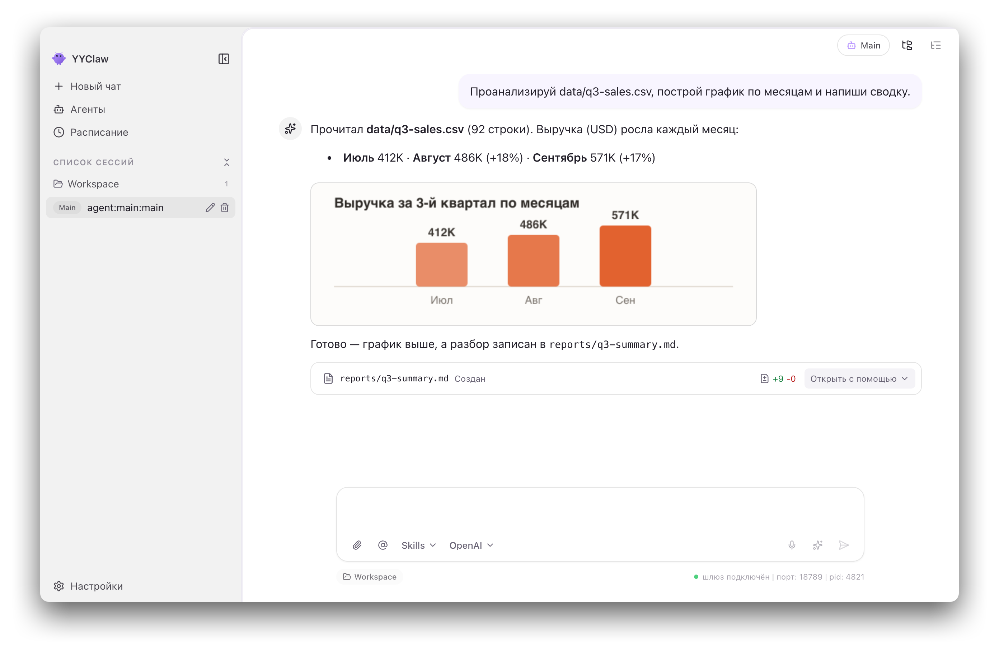
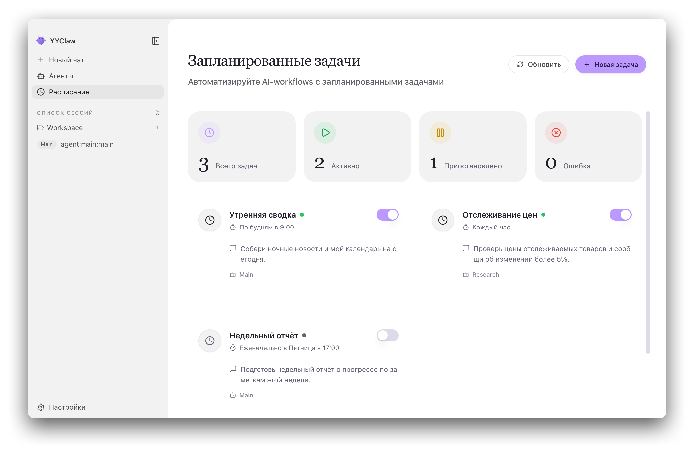
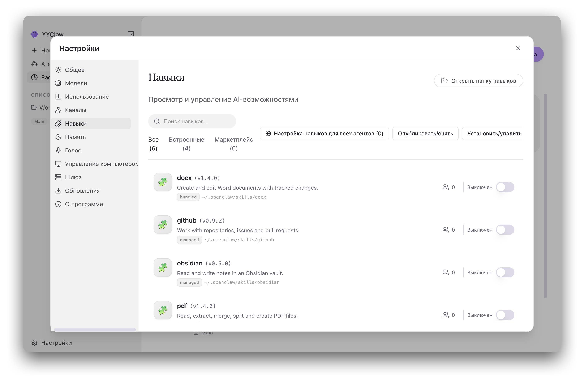
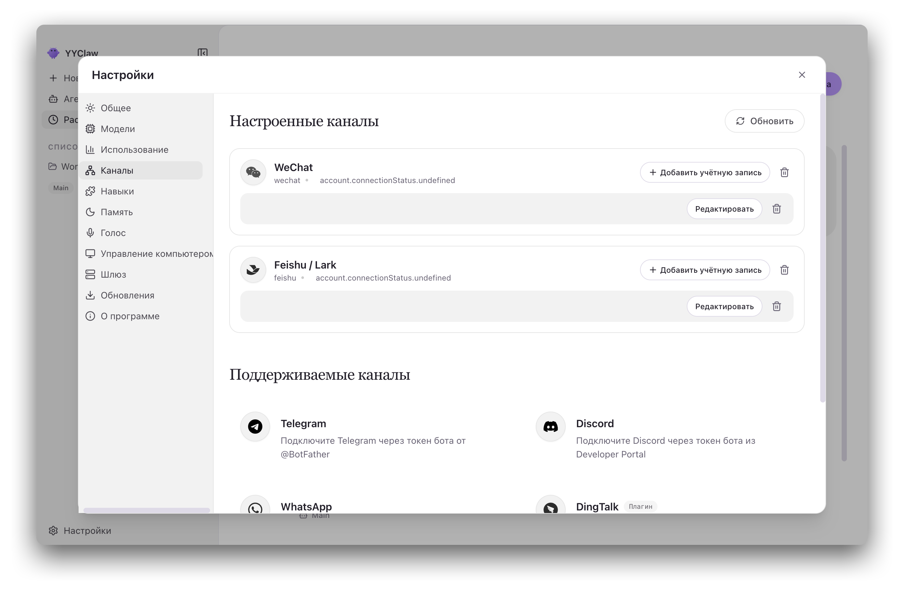
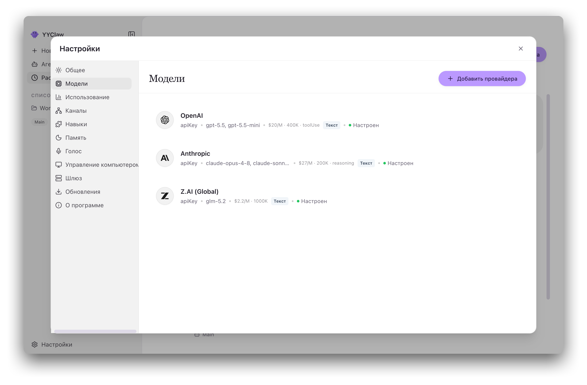
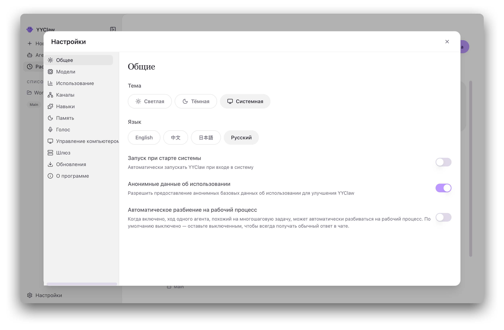

<p align="center">

Computer Use всегда доступен в Настройки → Управление компьютером без режима разработчика и остаётся выключенным до явного включения. Голосовой ввод, оптимизация запроса и отправка сгруппированы справа в поле ввода. Из встроенного каталога удалены старые корпоративные пресеты перед Anthropic; официальные провайдеры и сохранённые аккаунты не изменяются.
  
</p>

<h1 align="center">YYClaw</h1>

<p align="center">
  <strong>Десктоп-интерфейс для AI-агентов OpenClaw</strong>
</p>

<p align="center">
  <a href="#цели-и-философия">Философия</a> •
  <a href="#возможности">Возможности</a> •
  <a href="#сценарии-использования">Сценарии</a> •
  <a href="#быстрый-старт">Быстрый старт</a> •
  <a href="#архитектура">Архитектура</a> •
  <a href="#разработка">Разработка</a> •
  <a href="#участие-в-разработке">Участие</a>
</p>

<p align="center">
  
  
  
  
</p>

<p align="center">
  <a href="README.md">English</a> | <a href="README.zh-CN.md">简体中文</a> | <a href="README.ja-JP.md">日本語</a> | Русский
</p>

---

## Обзор

**YYClaw** — кроссплатформенное десктопное приложение, которое превращает
работающую только из командной строки среду AI-агентов
[OpenClaw](https://github.com/OpenClaw) в доступный десктопный опыт «всё включено».
Среда OpenClaw **встроена и управляется как локальный подпроцесс Gateway**, поэтому
на пути от установки до первого разговора вам не придётся касаться терминала,
YAML-файла или переменных окружения.

Из одного окна вы можете общаться с одним или несколькими агентами (текст, голос,
изображения), превращать мессенджеры в точки входа для агентов, планировать
повторяющиеся автоматические задачи, запускать детерминированные многошаговые
рабочие процессы, устанавливать и включать локальные навыки, настраивать несколько
AI-провайдеров с хранением учётных данных в системном хранилище ключей, а также
следить за расходом токенов и состоянием среды выполнения.

YYClaw поставляется с готовыми пресетами провайдеров, полноценной поддержкой Windows
и четырьмя языками интерфейса. Всё остальное доступно через
**Настройки → Расширенные → Разработчик**.

Коротко: это **открытая альтернатива размещённым офисным AI-агентам** — см.
[Позиционирование](#позиционирование-открытый-вариант-в-категории-офисных-агентов).


### Интеграция возможностей upstream

Поле ввода сохраняет локальные имена аккаунтов и выбор модели только для текущего диалога. Использование контекста ACP отображается перед статусом Gateway; новые данные среды выполнения приоритетны. Сжатие и просмотр дочерних агентов только для чтения сосуществуют с независимой лентой рабочих процессов. `@agent` начинает новый диалог целевого агента.

Резерв сжатия пересчитывается только при смене глобальной модели диалога: 25% явно заданного контекста или 50 000 токенов без метаданных. Переопределения агентов, медиаслоты и синхронизация при запуске не меняют резерв; явные настройки сохраняются.

DingTalk использует официальный upstream-коннектор с локальными несколькими аккаунтами и необязательной авторизацией рабочего пространства. Computer Use сохраняет upstream-жизненный цикл локального драйвера и разрешения. Настройки → О программе экспортируют обезличенную диагностику и явно выбранные исходные диалоги в локальный ZIP без автоматической отправки.

## Цели и философия

### Позиционирование: открытый вариант в категории офисных агентов

YYClaw решает ту же задачу, что и новое поколение универсальных офисных и рабочих
агентов — **WorkBuddy**, **TraeWork**, **Qwen Office (千问办公)**,
**Claude Cowork**, **ChatGPT Work** и другие продукты этой категории: AI-коллега,
который действительно выполняет работу с вашими документами, сообщениями,
расписанием и инструментами, а не просто отвечает на вопросы в окне чата.

Разница — в *способе поставки*. Такие продукты обычно размещаются у вендора,
построены на закрытом ядре и привязаны к собственным моделям вендора.
**YYClaw — самодостаточное десктопное приложение, построенное на открытой среде
агентов [OpenClaw](https://github.com/OpenClaw)**, которую вы сами запускаете,
проверяете, расширяете и которой владеете.

| | Типичный размещённый офисный агент | YYClaw |
|---|---|---|
| **Поставка** | Сервис, размещённый у вендора | Десктопное приложение, управляющее локальным подпроцессом Gateway |
| **Ядро** | Закрытое, разработано вендором | Открытый OpenClaw, встроен и управляется |
| **Где живут данные** | Облако вендора | Ваш диск; учётные данные — в хранилище ключей ОС |
| **Выбор модели** | Привязан к моделям вендора | Любой настроенный провайдер — OpenAI, Anthropic, Z.AI / GLM или любой OpenAI-совместимый шлюз |
| **Расширяемость** | Каталог плагинов под модерацией вендора | Локальные навыки, слой расширений, плагины каналов — без цикла одобрения |
| **Приватное развёртывание** | Обычно только в enterprise-тарифе или недоступно | Направьте каталог провайдеров и маркетплейс навыков на свой сервер |
| **Лицензия и оплата** | Подписка за место | MIT — можно аудировать, форкать, распространять внутри компании |

Продукты этой категории различаются между собой, и некоторые из них действительно
хороши. Утверждение здесь более узкое и конкретное: если вам нужен такой класс
возможностей, **не отдавая свою работу в чужое облако и не оказываясь запертым в
моделях одного вендора**, YYClaw — открытый путь к этому.

Всё изложенное ниже следует из этой позиции.

Создание AI-агентов не должно требовать владения командной строкой. YYClaw построен
вокруг одного убеждения: **мощная технология заслуживает интерфейса, который уважает
ваше время.** Из него следуют шесть принципов.

- **Нулевой порог настройки.** Пошаговый мастер и визуальные настройки с проверкой
  в реальном времени заменяют правку конфигурационных файлов вручную. Приложение
  полностью доступно для навигации и тестирования ещё до первого API-ключа.
- **Локально и приватно.** Среда выполнения — локальный Gateway на вашей машине,
  секреты хранятся в системном хранилище ключей, обязательной зависимости от облака
  нет. Ваши переписки и файлы рабочей области остаются на вашем диске.
- **Один стабильный интерфейс.** Все возможности бэкенда доступны через единый
  клиент. Смена протоколов и сложность процессов остаются за этой границей, поэтому
  быстро меняющаяся среда снизу не расшатывает приложение сверху.
- **Устойчивость по умолчанию.** Жизненный цикл Gateway, переподключение, таймауты
  и экспоненциальные задержки обрабатываются автоматически. Окно открывается и
  остаётся рабочим, пока среда ещё запускается: деградация заметна, но не смертельна.
- **Детерминизм там, где он важен.** Для многошаговых задач поток управления — это
  фиксированный код, а не усмотрение модели. Недетерминизм ограничен узлами, явно
  помеченными как модельные шаги, ограничен схемой и снабжён детерминированным
  резервным путём.
- **Расширяемость без форка.** Локальные навыки, подключаемый слой расширений и
  маркетплейса, а также настройка на уровне отдельного агента позволяют добавлять
  возможности, не патча само приложение.

Эти цели не декларативны, а принудительны: граница renderer/main, правило единой
точки входа и транспортная политика проверяются ESLint и спецификациями harness. См.
[инварианты архитектуры](docs/ARCHITECTURE.md#architecture-invariants).

## Скриншоты

<table>
  <tr>
    <td align="center"><br><em>Чат</em></td>
    <td align="center"><br><em>Запланированные задачи</em></td>
  </tr>
  <tr>
    <td align="center"><br><em>Навыки</em></td>
    <td align="center"><br><em>Каналы</em></td>
  </tr>
  <tr>
    <td align="center"><br><em>Модели</em></td>
    <td align="center"><br><em>Настройки</em></td>
  </tr>
</table>

## Возможности

| Возможность | Кратко |
|-------------|--------|
| **Мастер настройки** | Пошаговое начало: язык, провайдеры, наборы навыков, проверка |
| **Умный чат** | Мультиагентный чат с Markdown/LaTeX, `@agent`, `/skill`, выбором модели и артефактами |
| **Голосовое взаимодействие** | Диктовка и разговор в режиме Talk, а также озвучивание через TTS |
| **Управление агентами** | Модель, список навыков, привязка каналов и общие настройки для каждого агента |
| **Провайдеры и модели** | Настройка провайдеров/ключей и аналитика расхода токенов |
| **Мультиканальность** | Аккаунты каналов, вход по QR/OAuth, привязка агента к аккаунту |
| **Система навыков** | Локальный просмотр / установка / включение, опциональные маркетплейсы |
| **Планировщик** | Запланированные AI-задачи с внешней доставкой и историей запусков |
| **Движок процессов** | Детерминированная многошаговая оркестрация на XState |
| **Рабочая область агента** | Просмотр дерева файлов и предпросмотр рабочей области |
| **Генерация изображений** | Отдельная OpenAI-совместимая точка генерации изображений |
| **OpenClaw Dreams** | Сновидения `memory-core`: состояние, дневник, обслуживание |

### 🎯 Нулевой порог настройки

Пройдите весь путь — от установки до первого взаимодействия с AI — через графический
интерфейс. Мастер первого запуска проведёт вас через язык, учётные данные провайдера
(API-ключ или OAuth в браузере), наборы навыков и шаг проверки, заранее выбрав
системный язык, если он поддерживается. Мастер можно пропустить, и готовность Gateway
для его завершения не требуется.

### 💬 Умный чат

Несколько сессий с сохранением истории, ответы ассистента в Markdown с таблицами в
стиле GitHub и математикой KaTeX (пользовательский ввод остаётся обычным текстом), а
также потоковые ответы, которые продолжаются, когда вы уходите на другую страницу.

Наберите `@agent`, чтобы обратиться к другому агенту: YYClaw начнёт для него
новый диалог, а не будет передавать запрос через агента по
умолчанию. Навыки вставляются как чипы `/skill` — щёлкните по одному, чтобы прочитать
его `SKILL.md`. Когда настроено несколько моделей, переключатель показывает имена аккаунтов
и меняет модель только текущего диалога, не затрагивая настройки агента и не перезапуская Gateway.
Боковая панель сессий ориентирована на рабочие области, а правая панель предлагает
вкладки «Рабочая область», «Предпросмотр» и «Изменения» с предпросмотром только для
чтения для Markdown, `.docx`, `.pptx` и локального HTML.

### 🎙️ Голосовое взаимодействие

Говорите с агентами и слушайте их ответы — полностью через штатные Talk/TTS
Gateway RPC ядра OpenClaw, без дополнительных сервисов. *Диктовка* переводит речь по
нажатию в поле ввода для проверки, а режим *разговора* — это непрерывный диалог без
рук с серверным определением речевой активности и возможностью перебить. У каждого
ответа есть кнопка 🔊, а автоозвучивание может читать итоговые ответы автоматически.
Встроены две голосовые среды: **OpenAI** и **MiniMax**.

Голос строго зависит от конфигурации: если провайдер TTS или распознавания не задан,
элементы управления отключаются, и приложение отклоняет вызовы, а не переключается
молча на что-то другое.

### 🤖 Управление несколькими агентами

Создавайте и настраивайте несколько агентов, у каждого может быть своё
переопределение `provider/model` (агенты без него наследуют глобальную модель по
умолчанию), свой список разрешённых навыков и свои привязанные аккаунты каналов.
Рабочие области агентов по умолчанию раздельны; более строгая изоляция зависит от
настроек песочницы OpenClaw.

### 🔐 Безопасная интеграция провайдеров

Подключайте OpenAI, Anthropic, Z.AI / GLM и OpenAI-совместимые шлюзы — учётные данные
хранятся в системном хранилище ключей. OpenAI поддерживает и API-ключ, и OAuth в
браузере. Ключи проверяются при сохранении, с переходом на облегчённый запрос
`/chat/completions` или `/responses`, если шлюз отклоняет `/models` по причинам, не
связанным с аутентификацией. Для собственных провайдеров можно задать свой
`User-Agent` для чувствительных к заголовкам эндпоинтов.

Страница «Модели» также строит графики расхода токенов за скользящие окна 7 и 30 дней
с группировкой по модели или по времени, агрегируя данные из журналов сессий OpenClaw.

### 📡 Управление каналами

Запускайте независимые AI-каналы, каждый с несколькими аккаунтами, привязкой агента к
аккаунту и переключаемым аккаунтом по умолчанию. Встроенные плагины каналов —
персональный WeChat от Tencent, Feishu / Lark, WeCom, Discord, QQ и WhatsApp —
поддерживают вход по QR и OAuth прямо в приложении. При создании приложения Feishu
также автоматически настраивается меню быстрых команд бота (`/new`, `/stop`,
`/reset`, `/status`, `/compact`), чтобы управлять сессией нажатием, а не набором текста.

### ⏰ Автоматизация по расписанию

Планируйте AI-задачи как **повторяющиеся** (каждый час, ежедневно, по рабочим дням,
еженедельно или сырое cron-выражение) либо **однократные**. Внешняя доставка
настраивается прямо в форме задачи, с отдельными селекторами аккаунта-отправителя и
получателя — получатели определяются автоматически из справочников каналов или
истории сессий, так что править `jobs.json` вручную не нужно. Запланированные
промпты поддерживают тот же встроенный синтаксис `/skill`, что и поле чата, а каждая
задача хранит историю запусков.

### 🔀 Детерминированный движок процессов

Для задач с ясно определёнными шагами в главном процессе работает детерминированный
движок оркестрации (XState v5). Какой узел выполняется, какая ветка выбирается и
какой цикл повторяется — **зафиксировано полностью**; недетерминизм несут только узлы,
явно помеченные как *модельные* шаги, и они ограничены `temperature=0`, валидацией
zod и ограниченным числом повторов, с детерминированным резервным путём.

Каждый запуск даёт трассировку по узлам с пометкой каждого шага как
**детерминированный** или **модельный**, сохраняется как версионированные
JSON-снимки, поэтому после сбоя возобновляется без повторного выполнения
завершённых шагов, а прогресс транслируется в интерфейс. Задачи чата, автоматически
направленные в процесс, отображаются в переписке как служебное сообщение с всплывающим
индикатором прогресса.

### 🧩 Расширяемая система навыков

Страница навыков работает локально: она сканирует каталоги управляемых, встроенных,
расширенных и плагинных навыков — исключая рабочую область, `.agents` и
дополнительные каталоги, чтобы избежать дублирующихся версий — и включает или
отключает навыки без участия Gateway. Для каждого навыка показывается его реальное
расположение на диске, так что можно открыть настоящую папку.

Навыки обработки документов (`pdf`, `xlsx`, `docx`, `pptx`) из
[`anthropics/skills`](https://github.com/anthropics/skills) и отобранный каталог
поставляются в комплекте, разворачиваются в управляемый каталог навыков (по умолчанию
`~/.openclaw/skills`) при запуске и включаются при первой установке. Навыки с
платформенными ограничениями разворачиваются только там, где применимы. Замена
управляемого навыка транзакционна: неудачная установка восстанавливает предыдущую копию.

### 🌙 OpenClaw Dreams

Управляйте «сновидениями» `memory-core` в OpenClaw — фоновой консолидацией памяти —
включая состояние, дневник, обслуживание и включение/отключение. Требуется работающий
Gateway и настроенный на стороне OpenClaw плагин сновидений.

### 🎨 Темы, локализация и системная интеграция

Светлая, тёмная или синхронизированная с системой тема в теплой палитре, а также
четыре языка интерфейса (`en` / `zh` / `ja` / `ru`). Нативная интеграция включает
защиту от запуска второй копии, системный трей (закрытие окна свёртывает в трей,
выход — через меню трея), **автозапуск при входе в систему** в Настройках → Общие,
системные уведомления и проверку обновлений при старте с запросом перед загрузкой
или установкой.

> Полные подробности возможностей, включая нюансы реализации и ограничения, — в
> [docs/ru-RU/features.md](docs/ru-RU/features.md).

## Сценарии использования

- **🤖 Личный AI-ассистент.** Универсальный агент, который отвечает на вопросы, пишет
  черновики писем, резюмирует документы и решает повседневные задачи из аккуратного
  окна на рабочем столе — и голосом, когда руки заняты.
- **📊 Автоматический мониторинг.** Запланированные агенты следят за новостными
  лентами, отслеживают цены или ждут определённых событий, доставляя результат в тот
  мессенджер, который вы действительно читаете.
- **💼 Цифровой сотрудник в мессенджерах.** Привяжите агента к аккаунту WeChat,
  Feishu, WeCom, Discord, QQ или WhatsApp, чтобы коллеги и клиенты обращались к нему
  там, где уже находятся, а конфигурация и журнал остались на вашем рабочем столе.
- **💻 Продуктивность разработчика.** Агенты с доступом к рабочей области для ревью
  кода, генерации документации и однотипных правок — вкладка «Изменения» фиксирует
  файлы, затронутые на каждом шаге.
- **🔄 Надёжные многошаговые конвейеры.** Когда задача обязана выполняться одинаково
  каждый раз, движок процессов фиксирует поток управления и оставляет модели только
  те шаги, где она действительно нужна.
- **🧠 Долгие исследования.** Несколько агентов с отдельными рабочими областями и
  моделями плюс консолидация памяти на основе сновидений — для работы, растянутой на
  много сессий.

## Быстрый старт

### Системные требования

- **Операционная система:** macOS 11+, Windows 10+ или Linux (Ubuntu 20.04+)
- **Память:** минимум 4 ГБ, рекомендуется 8 ГБ
- **Диск:** 1 ГБ свободного места

### Установка релиза

Скачайте сборку для своей платформы со страницы
[Releases](https://github.com/compking2012/YYClaw/releases).

> **macOS:** скопируйте YYClaw из DMG в **/Applications** и запускайте оттуда. Если
> запустить приложение прямо из смонтированного DMG или другого тома только для
> чтения, встроенный механизм обновления не сможет заменить бандл приложения, и шаг
> установки может выглядеть так, будто ничего не происходит.

### Сборка из исходников

```bash
git clone https://github.com/compking2012/YYClaw.git
cd YYClaw

corepack enable          # активировать закреплённую версию pnpm
pnpm run init            # установить зависимости и скачать встроенные среды
pnpm dev                 # запустить в режиме разработки
```

OpenClaw Gateway запускается автоматически на порту `18789` и приходит в готовность
примерно за 10–30 секунд. Для работы над интерфейсом он не обязателен — приложение
показывает состояние «подключение» и остаётся рабочим.

### Первый запуск

**Мастер настройки** проведёт вас через четыре шага:

1. **Язык и регион** — системный язык выбирается заранее, если поддерживается, иначе
   английский
2. **AI-провайдер** — добавьте провайдеров по API-ключу или через OAuth в браузере
   либо на устройстве, где это поддерживается
3. **Наборы навыков** — выберите готовые навыки для типичных сценариев
4. **Проверка** — протестируйте конфигурацию перед входом в основной интерфейс

### Локальное управление компьютером

На поддерживаемых macOS и Windows явно включите Computer Use в настройках и предоставьте необходимые системные разрешения. Встроенный драйвер работает локально под управлением Electron Main. Приватный дескриптор `CLAWX_CUA_CONNECTION_FILE` передаётся OpenClaw; загрузка во время работы и внешнее сопряжение не требуются. Отключение настройки останавливает драйвер.

### Настройки прокси

Если Electron, Gateway или канал должны выходить в сеть через локальный прокси,
откройте **Настройки → Gateway → Прокси**, чтобы задать прокси по умолчанию и правила
обхода, а также при необходимости переопределить HTTP, HTTPS и `ALL_PROXY` / SOCKS в
режиме разработчика. Значение вида `host:port` трактуется как HTTP; типичное
локальное значение — `http://127.0.0.1:7890`. Сохранение немедленно переприменяет
сетевые настройки Electron и перезапускает Gateway.

> Поведение резервных прокси, синхронизация с Telegram и **OpenClaw Doctor** описаны
> в [docs/ru-RU/proxy-settings.md](docs/ru-RU/proxy-settings.md).

## Архитектура

YYClaw — это **двухпроцессное приложение Electron перед управляемым подпроцессом
OpenClaw Gateway**. Renderer никогда не обращается к сети или файловой системе
напрямую: весь доступ к бэкенду идёт через единый клиент, транспортной политикой
которого владеет главный процесс.

```
┌──────────────────────────────────────────────────────────────────┐
│                       YYClaw Desktop App                         │
│                                                                  │
│  ┌────────────────────────────────────────────────────────────┐  │
│  │  Electron Main Process                                     │  │
│  │  • Окно и жизненный цикл приложения                        │  │
│  │  • Управление процессом Gateway и его состоянием           │  │
│  │  • Системная интеграция (трей, уведомления, ключи)         │  │
│  │  • Владелец транспорта: WS -> HTTP -> IPC                  │  │
│  │  • Мост ACP stdio · движок процессов · автообновление      │  │
│  └────────────────────────────────────────────────────────────┘  │
│                            ▲                                     │
│    типизированный IPC через allowlist preload contextBridge      │
│                            ▼                                     │
│  ┌────────────────────────────────────────────────────────────┐  │
│  │  React Renderer Process                                    │  │
│  │  • Интерфейс на React 19 · хранилища Zustand               │  │
│  │  • Единая точка входа: host-api.ts + host-api-client.ts    │  │
│  │  • Без импорта Node.js и прямых запросов к localhost       │  │
│  └────────────────────────────────────────────────────────────┘  │
└──────────────────────────────────────────────────────────────────┘
                             │
                             │ WebSocket / HTTP во владении Main
                             ▼            (127.0.0.1:18789)
┌──────────────────────────────────────────────────────────────────┐
│               OpenClaw Gateway (подпроцесс)                      │
│                                                                  │
│  • Среда выполнения и оркестрация AI-агентов                     │
│  • Управление каналами сообщений                                 │
│  • Среда исполнения навыков и плагинов                           │
│  • Слой абстракции провайдеров                                   │
└──────────────────────────────────────────────────────────────────┘
```

### Особенности архитектуры

- **Изоляция процессов.** Среда AI работает в отдельном процессе, поэтому интерфейс
  остаётся отзывчивым при тяжёлых вычислениях, а сбой среды не уносит с собой окно.
- **Единая точка входа фронтенда.** Весь доступ renderer к бэкенду идёт через
  [`src/lib/host-api.ts`](src/lib/host-api.ts) и
  [`src/lib/host-api-client.ts`](src/lib/host-api-client.ts). Ни одна страница или компонент не
  вызывает IPC напрямую.
- **Транспортом владеет Main.** Транспортная политика жёстко задана как откат
  `WS → HTTP → IPC` и принадлежит главному процессу; renderer не реализует логику
  переключения протоколов.
- **Preload — единственный мост.** Renderer не импортирует модули Node.js;
  allowlist `contextBridge` в preload — единственная поверхность.
- **Безопасность в отношении CORS по построению.** Renderer никогда не вызывает
  локальные HTTP-эндпоинты Gateway или Host API — они идут через прокси-каналы Main.
- **Чат на основе ACP.** Чат общается с OpenClaw по
  [ACP (Agent Client Protocol)](https://agentclientprotocol.com) через мост stdio во
  владении Main, давая относительно стабильную поверхность протокола перед быстро
  меняющейся средой, с воспроизведением истории с аутентификацией и потоковой
  передачей, которая выживает при навигации.
- **Горячая конфигурация.** Обычные изменения провайдеров, агентов, навыков и моделей
  применяются без замены процесса Gateway; учётные данные перезагружаются на ходу, а
  защищённое восстановление начинается только после нескольких пропущенных
  heartbeat-сигналов.
- **Единственный владелец Gateway.** Слушать `127.0.0.1:18789` может ровно один
  процесс.
- **Безопасное хранение.** API-ключи и чувствительные данные используют штатное
  защищённое хранилище операционной системы.

> Диаграмма слоёв, трёхуровневая модель коммуникации, семантика файловой активности
> ACP, доставка конфигурации и диагностика Gateway описаны в
> [docs/ru-RU/architecture.md](docs/ru-RU/architecture.md) и
> [docs/ARCHITECTURE.md](docs/ARCHITECTURE.md).

## Разработка

### Требования

- **Node.js** 22.22.3+, 24.15.0+ или 25.9.0+ в пределах соответствующей мажорной
  линии (рекомендуется Node 24 LTS)
- **pnpm**, версия закреплена полем `packageManager` в `package.json`. Выполните
  `corepack enable`, чтобы активировать нужную версию. **npm и yarn не
  поддерживаются.**
- **Linux (Ubuntu/Debian):** перед запуском Electron установите необходимые
  системные библиотеки — см. [docs/ru-RU/development.md](docs/ru-RU/development.md)

### Структура проекта

```
YYClaw/
├── electron/                # Главный процесс Electron
│   ├── main/                # Точка входа, окна, регистрация IPC
│   ├── preload/             # Безопасный мост IPC contextBridge
│   ├── api/                 # Типизированный роутер API на стороне Main
│   ├── gateway/             # Менеджер процесса OpenClaw Gateway
│   ├── workflow/            # Детерминированный движок XState
│   ├── extensions/          # Расширения главного процесса
│   ├── services/            # Провайдеры, секреты, сервисы среды
│   └── utils/               # Хранилище, авторизация, пути, телеметрия
├── src/                     # Процесс renderer на React
│   ├── lib/                 # Единый API фронтенда и модель ошибок
│   ├── stores/              # Хранилища Zustand (настройки/чат/gateway)
│   ├── components/          # Переиспользуемые UI-компоненты
│   ├── pages/               # Chat, Agents, Channels, Cron, Workflows,
│   │                        # Skills, Models, Settings, Setup, Dreams,
│   │                        # ImageGeneration, Login
│   └── styles/              # Дизайн-токены и глобальный CSS
├── shared/                  # Межпроцессные контракты и локали i18n
├── harness/                 # Harness проверки AI-кодирования по спекам
├── docs/                    # Архитектура, продукт и локализованные док-ты
├── tests/
│   ├── unit/                # Модульные и интеграционные тесты Vitest
│   └── e2e/                 # Сквозные тесты Playwright для Electron
├── resources/               # Иконки, скриншоты, встроенные бинарники
└── scripts/                 # Скрипты сборки, упаковки и утилиты
```

### Основные команды

```bash
pnpm run init        # Установить зависимости и скачать встроенные среды
pnpm dev             # Запуск в режиме разработки с горячей перезагрузкой
pnpm lint            # Запустить ESLint с автоисправлением
pnpm typecheck       # Проверка TypeScript (проекты node и web)
pnpm test            # Запустить модульные тесты (Vitest)
pnpm run test:e2e    # Запустить сквозные тесты Electron (Playwright)
pnpm build           # Полная production-сборка
pnpm package         # Упаковать под текущую платформу (:mac / :win / :linux)
```

На Linux без графической среды запускайте тесты Electron под дисплейным сервером,
например `xvfb-run -a pnpm run test:e2e`.

> Сборка Linux `.deb` на macOS требует GNU tar и GNU ar
> (`brew install gnu-tar binutils`). Без них встроенный `fpm` молча создаёт
> некорректный 96-байтный `.deb`, всё равно сообщая об успехе; теперь
> `pnpm package:linux` сразу завершается с ошибкой, если чего-то не хватает.

Если изменение затрагивает пути коммуникации — события gateway, мост чата ACP,
доставку в каналы или откат транспорта — запустите регрессионные проверки:

```bash
pnpm run comms:replay
pnpm run comms:compare
```

### Технологический стек

| Слой | Технология |
|------|------------|
| Среда выполнения | Electron 40 |
| Интерфейс | React 19 + TypeScript 5.9 |
| Стили | Tailwind CSS 3.4 + shadcn/ui (Radix UI) |
| Состояние | Zustand 5 |
| Оркестрация | XState 5 |
| Сборка | Vite 7 + electron-builder 26 |
| Тестирование | Vitest 4 + Playwright |
| Анимация | Framer Motion |
| Иконки | Lucide React |
| Формулы / редактор | KaTeX · Monaco Editor |

> Настройка редактора, профилирование производительности и детали E2E — в
> [docs/ru-RU/development.md](docs/ru-RU/development.md).

## Участие в разработке

Мы рады любому вкладу — исправлениям ошибок, новым возможностям, документации и
переводам.

1. Сделайте **fork** репозитория
2. **Создайте** ветку для функциональности (`git checkout -b feature/amazing-feature`)
3. **Зафиксируйте** изменения с понятными сообщениями
4. **Отправьте** изменения в свою ветку
5. **Откройте** pull request

Перед открытием PR убедитесь, что:

- `pnpm lint`, `pnpm typecheck` и `pnpm test` проходят
- Изменения интерфейса, видимые пользователю, добавляют или обновляют спеку
  Playwright E2E в том же PR
- Новые пользовательские строки проходят через `react-i18next` и покрыты во всех
  четырёх локалях (`en` / `zh` / `ja` / `ru`)
- Изменения путей коммуникации проходят `pnpm run comms:replay` и
  `pnpm run comms:compare`
- Изменения поведения, потоков или интерфейсов обновляют затронутую документацию в
  том же PR

Соглашения проекта — в [AGENTS.md](AGENTS.md) и
[docs/TROUBLESHOOTING.md](docs/TROUBLESHOOTING.md). Пожалуйста, прочитайте также
[Кодекс поведения](CODE_OF_CONDUCT.md) и [Политику безопасности](SECURITY.md).

## Благодарности

YYClaw произошёл от **ClawX** команды [ValueCell](https://valuecell.ai), чья работа
стала фундаментом этого проекта. Спасибо.

Он также опирается на замечательные open-source проекты:

- [OpenClaw](https://github.com/OpenClaw) — среда выполнения AI-агентов в его основе
- [Electron](https://www.electronjs.org/) — кроссплатформенный десктопный фреймворк
- [React](https://react.dev/) — библиотека интерфейсов
- [Vite](https://vite.dev/) — инструменты сборки
- [Tailwind CSS](https://tailwindcss.com/), [shadcn/ui](https://ui.shadcn.com/) и
  [Radix UI](https://www.radix-ui.com/) — стили и доступные примитивы
- [Zustand](https://github.com/pmndrs/zustand) — легковесное управление состоянием
- [XState](https://stately.ai/docs) — детерминированный движок процессов
- [Framer Motion](https://motion.dev/) и [Lucide](https://lucide.dev/) — анимация и
  иконки
- [KaTeX](https://katex.org/) и
  [Monaco Editor](https://microsoft.github.io/monaco-editor/) — рендеринг формул и кода
- [Vitest](https://vitest.dev/) и [Playwright](https://playwright.dev/) — тестирование
- [electron-builder](https://www.electron.build/) и
  [electron-updater](https://www.electron.build/auto-update) — упаковка и обновления
- [anthropics/skills](https://github.com/anthropics/skills) — встроенные навыки
  обработки документов
- Авторам плагинов каналов из Tencent (WeChat, QQ), Lark/Feishu, WeCom и экосистемы
  плагинов OpenClaw (Discord, WhatsApp)

## Лицензия

YYClaw выпускается под [лицензией MIT](LICENSE). Вы можете свободно использовать,
изменять и распространять это программное обеспечение.
