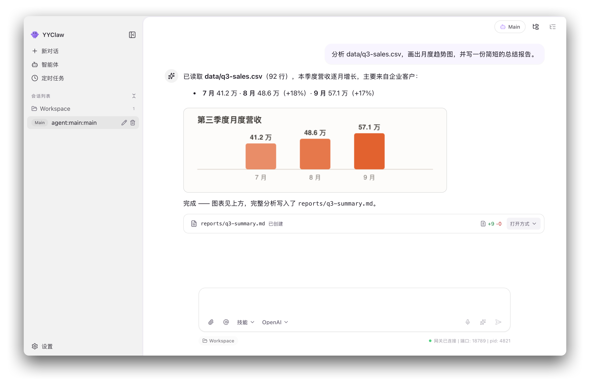
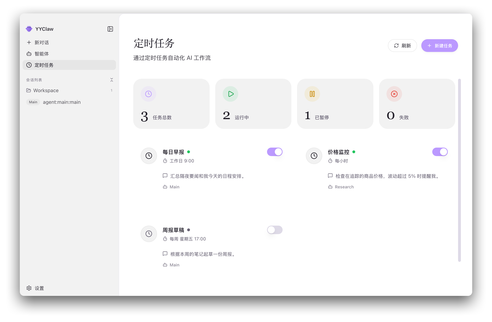
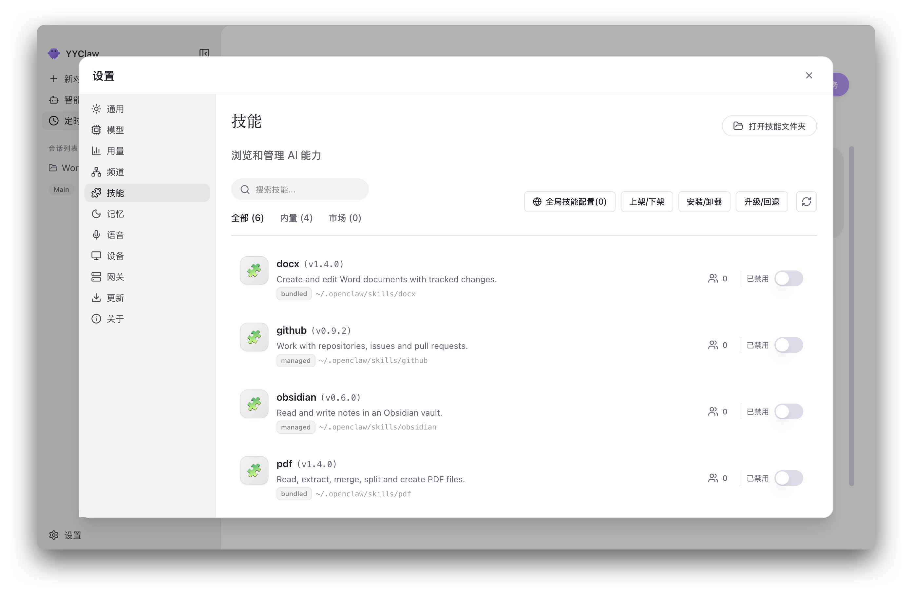
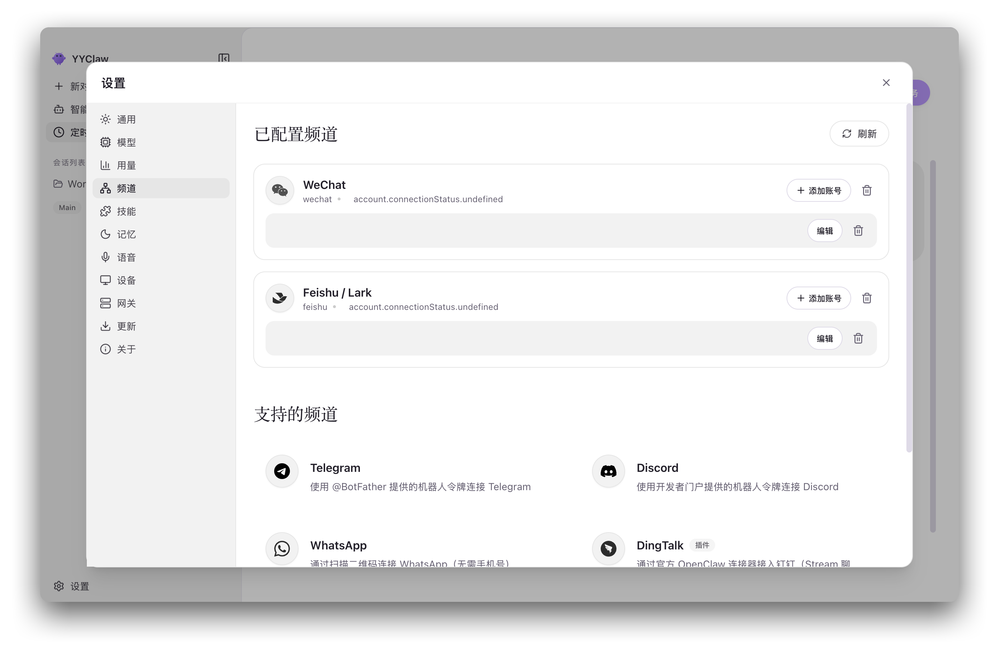
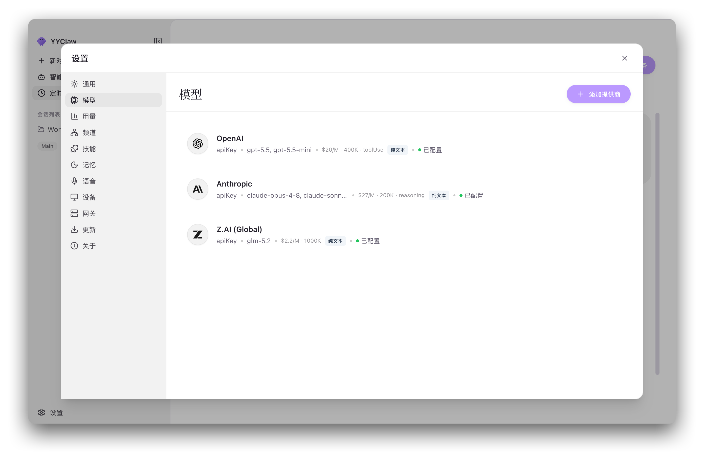
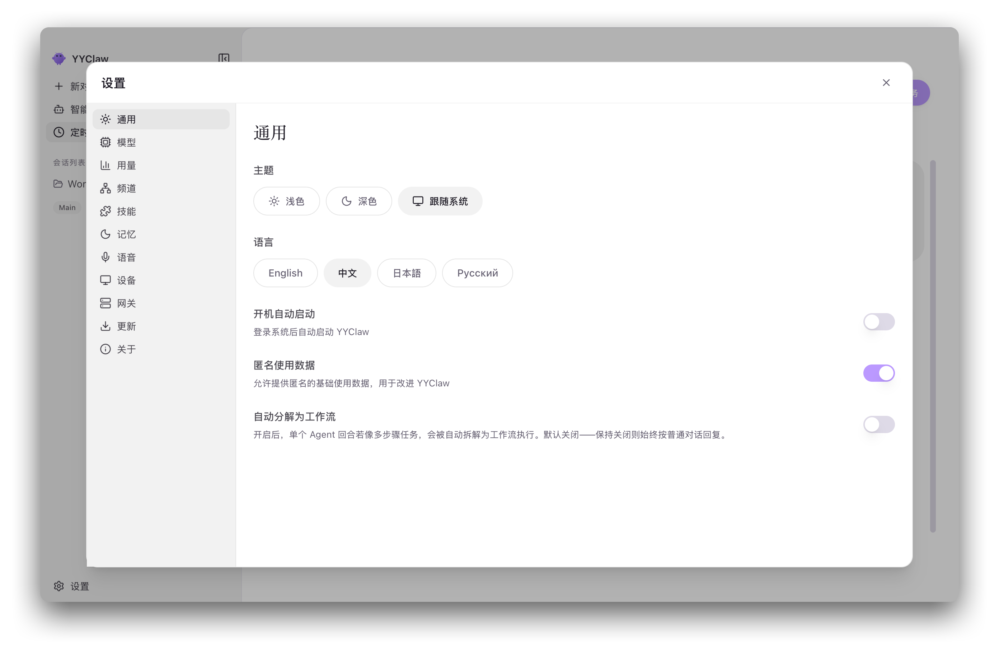

<p align="center">

界面中的产品名统一通过 YYClaw 品牌翻译显示，不再残留 ClawX 文案。紫色主按钮和渐变按钮在浅色、深色主题下均使用白色文字；内部标识及上游链接不变。

「设置 → 设备」提供始终可见、默认关闭的操作计算机功能，采用与其他设置页一致的全宽布局、标题字体、卡片和页头刷新按钮。记忆页面恢复四种语言的翻译注册，中文沿用合并前的梦境文案。
  
</p>

<h1 align="center">YYClaw</h1>

<p align="center">
  <strong>OpenClaw AI 智能体的桌面客户端</strong>
</p>

<p align="center">
  <a href="#设计目标与理念">设计理念</a> •
  <a href="#功能特性">功能特性</a> •
  <a href="#应用场景">应用场景</a> •
  <a href="#快速上手">快速上手</a> •
  <a href="#技术架构">技术架构</a> •
  <a href="#开发指南">开发指南</a> •
  <a href="#参与贡献">参与贡献</a>
</p>

<p align="center">
  
  
  
  
</p>

<p align="center">
  <a href="README.md">English</a> | 简体中文 | <a href="README.ja-JP.md">日本語</a> | <a href="README.ru-RU.md">Русский</a>
</p>

---

## 概述

**YYClaw** 是一款跨平台桌面应用，把只能在命令行使用的
[OpenClaw](https://github.com/OpenClaw) AI 智能体运行时，变成一个开箱即用、
无需额外配置的桌面体验。OpenClaw 运行时以**本地 Gateway 子进程**的形式被内置并托管，
因此从安装到第一次对话，你完全不需要碰终端、YAML 文件或环境变量。

在同一个窗口里，你可以与一个或多个智能体对话（文本、语音、图像），把即时通讯渠道
变成智能体的接入入口，编排周期性自动任务，运行确定性多步工作流，安装与开关本地优先的
技能，配置多家 AI 供应商（凭据存放在系统钥匙串中），并观察 token 用量与运行时健康状况。

YYClaw 预置了最佳实践的供应商配置，原生支持 Windows，并提供四种界面语言。
其余高级选项都可以在 **设置 → 高级 → 开发者模式** 中找到。

简单说，它是**托管式办公智能体产品的开源替代方案** ——
详见[产品定位](#产品定位通用办公智能体赛道里的开源方案)。


### 上游能力整合

输入框保留本地账户名展示及仅当前会话切换模型的行为。ACP 上下文用量显示在网关状态左侧，新上报的运行时总量优先；压缩状态与内嵌子 Agent 状态、实时只读下钻及直接返回父会话和本地独立工作流时间线共存。`@agent` 发送会为目标智能体开启新会话。

压缩预留只在修改全局默认对话模型时重新计算：显式上下文窗口的 25%，缺少元数据时为 50,000 token。智能体模型覆盖、媒体能力槽位和启动同步不重新计算；用户显式压缩设置保留。

钉钉采用上游官方连接器并保留本地多账号及可选工作区授权。Computer Use 沿用上游本地驱动生命周期与权限机制。「设置 → 关于」可将脱敏诊断和用户明确选择的原始会话导出为本地 ZIP，不自动上传。

## 设计目标与理念

### 产品定位：通用办公智能体赛道里的开源方案

YYClaw 要解决的，与新一代通用办公智能体是同一件事 —— 对标 **WorkBuddy**、
**TraeWork**、**千问办公**、**Claude Cowork**、**ChatGPT Work** 等产品：
一个能在你的文档、消息、日程与工具之间真正干活的 AI 同事，而不只是在对话框里回答问题。

差别在于*交付方式*。这类产品通常由厂商托管、内核闭源、并绑定厂商自家的模型。
**YYClaw 是一个自包含的桌面应用，构建在开源的
[OpenClaw](https://github.com/OpenClaw) 智能体运行时之上** —— 由你自己运行、审查、
扩展和拥有。

| | 典型的托管式办公智能体 | YYClaw |
|---|---|---|
| **交付形态** | 厂商托管的云端服务 | 桌面应用 + 本机上受托管的 Gateway 子进程 |
| **内核运行时** | 闭源、厂商自研 | 开源 OpenClaw，内置并受托管 |
| **数据存放** | 厂商的云端 | 你自己的磁盘；凭据存于系统钥匙串 |
| **模型选择** | 绑定厂商自家模型 | 任意你配置的供应商 —— OpenAI、Anthropic、Z.AI / GLM，或任何 OpenAI 兼容网关 |
| **可扩展性** | 厂商审核的插件目录 | 本地优先技能 + 扩展层 + 渠道插件，无需等待审核 |
| **私有化部署** | 通常属企业版，或不提供 | 可将供应商目录与技能市场指向你自建的服务 |
| **许可与计费** | 按席位订阅 | MIT —— 可审计、可 fork、可在内部自行分发 |

这个赛道里的产品各有差异，其中不少确实做得很好。这里的主张是更收窄、更具体的：
如果你想要这一类能力，但**不希望把工作交给别人的云，也不希望被单一厂商的模型锁定**，
YYClaw 就是通往它的开源路径。

下面的原则，都是从这个立场推导出来的。

构建 AI 智能体不该以精通命令行为前提。YYClaw 的设计围绕一个信念：
**强大的技术，理应配一个尊重你时间的界面。** 由此衍生出六条原则。

- **零配置门槛。** 用引导式配置向导和带实时校验的可视化设置，取代手写配置文件。
  在你填入第一个 API Key 之前，整个应用就已经可以完整浏览与测试。
- **本地优先与隐私。** 运行时是你本机上的一个本地 Gateway，密钥存放在系统原生钥匙串中，
  不存在强制的云端依赖。你的对话与工作区文件始终留在自己的磁盘上。
- **单一稳定接口。** 所有后端能力都通过同一个统一客户端访问。协议演进与进程复杂度
  被隔离在这层边界之后 —— 底层运行时快速迭代，不会动摇上层应用的稳定性。
- **默认具备韧性。** Gateway 生命周期、重连、超时与退避全部自动处理。运行时还在启动时，
  窗口就已经打开并可用 —— 降级是可见的，而不是致命的。
- **在关键处保持确定性。** 对多步任务而言，控制流是固定的代码，而不是模型的临场判断。
  非确定性被限制在显式标记为「模型步骤」的节点内，受 schema 约束，并配有确定性兜底路径。
- **可扩展而无需分叉。** 本地优先的技能体系、可插拔的扩展 / 市场层，以及按智能体维度的
  自定义能力，让你无需修改应用本体即可增加能力。

这些目标是被强制执行的，而非停留在口号：渲染进程 / 主进程边界、单一入口规则与传输策略
都由 ESLint 和 harness 规格校验。详见
[架构不变量](docs/ARCHITECTURE.md#architecture-invariants)。

## 截图预览

<table>
  <tr>
    <td align="center"><br><em>聊天</em></td>
    <td align="center"><br><em>定时任务</em></td>
  </tr>
  <tr>
    <td align="center"><br><em>技能</em></td>
    <td align="center"><br><em>渠道</em></td>
  </tr>
  <tr>
    <td align="center"><br><em>模型</em></td>
    <td align="center"><br><em>设置</em></td>
  </tr>
</table>

## 功能特性

| 功能 | 简介 |
|------|------|
| **配置向导** | 引导式初始化：语言、供应商、技能包、验证 |
| **智能聊天** | 多智能体对话，支持 Markdown/LaTeX、`@agent`、`/skill`、模型选择、产物预览 |
| **语音交互** | Talk 模式听写与免手对话，以及 TTS 朗读 |
| **多智能体管理** | 按智能体配置模型、技能白名单、渠道绑定与全局设置 |
| **供应商与模型** | 供应商 / 密钥配置，以及滚动窗口的 token 用量分析 |
| **多渠道管理** | 渠道账号、扫码 / OAuth 登录、按账号绑定智能体 |
| **技能体系** | 本地优先的浏览 / 安装 / 启停，以及可选的技能市场 |
| **定时任务** | 计划型 AI 任务，支持外部投递与运行历史 |
| **工作流引擎** | 基于 XState 的确定性多步编排 |
| **智能体工作区** | 以文件树浏览并预览智能体工作区 |
| **图像生成** | 独立的 OpenAI 兼容图像生成端点 |
| **OpenClaw 梦境** | `memory-core` 梦境机制：状态、日记、维护 |

### 🎯 零配置门槛

从安装到第一次 AI 交互，全流程都在图形界面中完成。首次启动的配置向导会依次引导你完成
语言、供应商凭据（API Key 或浏览器 OAuth）、技能包与验证步骤，并在系统语言受支持时
自动预选。向导可以跳过，且完成它并不要求 Gateway 已就绪。

### 💬 智能聊天

多会话与持久化历史；助手回复以 Markdown 渲染，支持 GitHub 风格表格与 KaTeX 数学公式
（用户输入保持为字面文本）；流式回复在你切换页面后仍会继续。

输入 `@agent` 即可指向另一个智能体 —— YYClaw 会为该智能体新建一个会话，
而不是通过默认智能体转发。技能以 `/skill` 标签的形式插入，点击即可阅读其 `SKILL.md`。
当配置了多个模型时，模型选择器保留账号名称，只覆盖当前会话的模型，
不改变智能体默认模型，也无需重启 Gateway。会话侧边栏以工作区为先，右侧面板提供工作区、预览与变更三个页签，
并对 Markdown、`.docx`、`.pptx` 和本地 HTML 提供只读预览。

### 🎙️ 语音交互

与智能体对话并听取回复，全程通过 OpenClaw 内核原生的 Talk/TTS Gateway RPC 完成 ——
无需额外服务。*听写* 模式把按键说话的语音转写进输入框供你确认；*对话* 模式则是持续的
免手交互，具备服务端语音活动检测与打断能力。每条回复都带一个 🔊 播放按钮，
自动朗读可以自动读出最终回复。内置两种语音运行时：**OpenAI** 与 **MiniMax**。

语音严格受配置门控 —— 未设置 TTS 或转写供应商时，相关控件会被禁用，应用会直接拒绝调用，
而不是静默回退到其他方案。

### 🤖 多智能体管理

创建并配置多个智能体，每个都可以有自己的 `provider/model` 覆盖（未覆盖的智能体继承
全局默认模型）、自己的启用技能白名单，以及自己绑定的渠道账号。智能体工作区默认相互独立，
更强的隔离取决于 OpenClaw 的沙箱设置。

### 🔐 安全的供应商集成

接入 OpenAI、Anthropic、Z.AI / GLM 以及各类 OpenAI 兼容网关，凭据存放在系统原生钥匙串中。
OpenAI 同时支持 API Key 与浏览器 OAuth。密钥在保存时会被校验；当某个网关因非鉴权原因
拒绝 `/models` 时，会自动回退到轻量的 `/chat/completions` 或 `/responses` 探测。
自定义供应商可以设置专属 `User-Agent`，以适配对请求头敏感的端点。

模型页还会以 7 天 / 30 天滚动窗口展示 token 用量图表，可按模型或时间分组，
数据来自 OpenClaw 的会话记录。

### 📡 多渠道管理

运行相互独立的 AI 渠道，每个渠道支持多账号、按账号绑定智能体，以及可切换的默认账号。
内置渠道插件均提供应用内扫码与 OAuth 流程 —— 腾讯个人微信、飞书 / Lark、企业微信、
Discord、QQ 与 WhatsApp。一键创建飞书应用时还会自动配置快捷指令机器人菜单
（`/new`、`/stop`、`/reset`、`/status`、`/compact`），用户点一下就能控制会话，无需手动输入。

### ⏰ 定时任务自动化

以**周期**（每小时、每天、工作日、每周或原生 cron 表达式）或**单次**方式编排 AI 任务。
外部投递直接在任务表单中配置，发送账号与接收目标分开选择 —— 接收目标会从渠道通讯录或
会话历史中自动发现，因此无需手工编辑 `jobs.json`。计划任务的提示词同样支持与聊天输入框
一致的内联 `/skill` 语法，且每个任务都保留运行历史。

### 🔀 确定性工作流引擎

对于步骤明确的任务，主进程中会运行一个确定性编排引擎（XState v5）。哪个节点执行、
走哪个分支、循环几次都是**完全固定**的；只有显式标记为*模型*步骤的节点带有非确定性，
且这些节点受 `temperature=0`、zod 校验与有限重试约束，并配有确定性兜底路径。

每次运行都会产出逐节点的执行轨迹，标注每一步是**确定性**还是**模型**步骤；运行状态以
带版本的 JSON 快照持久化，崩溃后可恢复而无需重跑已完成步骤，进度实时推送到界面。
被自动路由到工作流的聊天任务，会以流程消息的形式内联出现在会话中，并附带进度浮层。

### 🧩 可扩展技能体系

技能页是本地优先的：它会扫描托管目录、内置技能、扩展与插件技能目录 —— 并排除工作区、
`.agents` 及额外目录以避免重复版本 —— 且启停技能不依赖 Gateway。每个技能都会显示
其真实的磁盘位置，你可以直接打开对应文件夹。

来自 [`anthropics/skills`](https://github.com/anthropics/skills) 的文档处理技能
（`pdf`、`xlsx`、`docx`、`pptx`）以及一批精选技能已预先内置，会在启动时部署到托管技能目录
（默认 `~/.openclaw/skills`）并在首次安装时启用。受平台限制的技能只在适用平台部署。
替换托管技能是事务性的 —— 安装失败会恢复到先前的副本。

### 🌙 OpenClaw 梦境

管理 OpenClaw `memory-core` 的「梦境」机制 —— 即后台记忆整合 —— 包括状态查看、日记、
维护操作与启用 / 停用。需要 Gateway 正在运行，且 OpenClaw 侧已配置梦境插件。

### 🎨 主题、本地化与系统集成

浅色、深色或跟随系统的主题，采用暖色调配色，并提供四种界面语言（`en` / `zh` / `ja` / `ru`）。
原生集成涵盖单实例保护、系统托盘（点击关闭会隐藏到托盘，退出请用托盘菜单）、
**设置 → 通用** 中的**开机自启动**、系统通知，以及启动时检查更新并在下载或安装前询问。

> 完整的功能细节，包括实现注意事项与限制，见
> [docs/zh-CN/features.md](docs/zh-CN/features.md)。

## 应用场景

- **🤖 个人 AI 助手。** 一个通用智能体，在清爽的桌面窗口里回答问题、起草邮件、
  总结文档、处理日常事务 —— 腾不出手时还可以用语音。
- **📊 自动化监控。** 用计划任务让智能体盯着资讯源、追踪价格或等待特定事件发生，
  并把结果投递到你真正会看的消息渠道。
- **💼 IM 渠道数字员工。** 把智能体绑定到微信、飞书、企业微信、Discord、QQ 或 WhatsApp
  账号，让同事或客户在他们已有的工具里直接找到它，而配置与审计记录仍留在你的桌面端。
- **💻 开发者效率。** 让具备工作区访问权的智能体做代码评审、生成文档、执行重复性改动 ——
  「变更」页签会记录每一轮对话触碰过的文件。
- **🔄 可靠的多步流水线。** 当一个任务必须每次都以相同方式执行时，工作流引擎会固定控制流，
  只在真正需要判断的步骤上引入模型。
- **🧠 长周期研究。** 多个智能体各自拥有独立工作区、独立模型，配合基于梦境的记忆整合，
  支撑跨越多次会话的工作。

## 快速上手

### 系统要求

- **操作系统：** macOS 11+、Windows 10+ 或 Linux（Ubuntu 20.04+）
- **内存：** 最低 4 GB，推荐 8 GB
- **存储：** 1 GB 可用磁盘空间

- **Computer Use**：macOS 13+ x64/arm64，或 Windows 10+ x64；YYClaw 在其他受支持平台上仍可正常使用，但不提供此功能

### 安装发行版

从 [Releases](https://github.com/compking2012/YYClaw/releases) 页面下载对应平台的安装包。

> **macOS：** 请从 DMG 中把 YYClaw 复制到 **/Applications** 再运行。如果直接从挂载的 DMG
> 或其他只读卷启动，应用内更新程序将无法替换 app 包，安装步骤可能看起来毫无反应。

### 从源码构建

```bash
git clone https://github.com/compking2012/YYClaw.git
cd YYClaw

corepack enable          # 启用锁定版本的 pnpm
pnpm run init            # 安装依赖并下载内置运行时
pnpm dev                 # 以开发模式启动
```

OpenClaw Gateway 会在 `18789` 端口自动启动，约需 10–30 秒进入就绪状态。
它并非 UI 开发的前置条件 —— 应用会显示「连接中」状态并保持可用。

### 首次启动

**配置向导**会引导你完成四个步骤：

1. **语言与地区** —— 系统语言受支持时自动预选，否则回退为英文
2. **AI 供应商** —— 通过 API Key 添加，或在支持的供应商上使用浏览器 / 设备 OAuth
3. **技能包** —— 为常见场景挑选预置技能
4. **验证** —— 进入主界面之前先测试配置

### 本地电脑操作

在支持的 macOS 与 Windows 系统上，需在设置中主动启用 Computer Use，并授予所需系统权限。内置驱动在本地运行，由 Electron 主进程托管；通过私有 `CLAWX_CUA_CONNECTION_FILE` 描述文件提供给 OpenClaw，无需运行时下载或外部配对。关闭设置会停止驱动。

### 代理设置

当 Electron、Gateway 或某个渠道需要通过本地代理访问网络时，打开
**设置 → Gateway → 代理** 配置默认代理与绕过规则，以及开发者模式下针对 HTTP、HTTPS 和
`ALL_PROXY` / SOCKS 的可选覆盖项。仅填 `host:port` 时会按 HTTP 处理；
本地常见取值是 `http://127.0.0.1:7890`。保存后会立即重新应用 Electron 网络设置并重启 Gateway。

> 代理回退行为、Telegram 同步以及 **OpenClaw Doctor** 的说明见
> [docs/zh-CN/proxy-settings.md](docs/zh-CN/proxy-settings.md)。

## 技术架构

YYClaw 是一个**双进程 Electron 应用，前置于一个受托管的 OpenClaw Gateway 子进程**。
渲染进程从不直接接触网络或文件系统；所有后端访问都经由同一个统一客户端，
其传输策略由主进程掌控。

```
┌──────────────────────────────────────────────────────────────────┐
│                       YYClaw Desktop App                         │
│                                                                  │
│  ┌────────────────────────────────────────────────────────────┐  │
│  │  Electron Main Process                                     │  │
│  │  • 窗口与应用生命周期                                      │  │
│  │  • Gateway 进程托管与健康检查                              │  │
│  │  • 系统集成（托盘、通知、钥匙串）                          │  │
│  │  • 传输策略归属方：WS -> HTTP -> IPC                       │  │
│  │  • ACP stdio 桥 · 工作流引擎 · 自动更新                    │  │
│  └────────────────────────────────────────────────────────────┘  │
│                            ▲                                     │
│       经 preload contextBridge 白名单的类型化 IPC                │
│                            ▼                                     │
│  ┌────────────────────────────────────────────────────────────┐  │
│  │  React Renderer Process                                    │  │
│  │  • React 19 界面 · Zustand 状态                            │  │
│  │  • 单一入口：host-api.ts + host-api-client.ts              │  │
│  │  • 不导入 Node.js 模块，不直连 localhost                   │  │
│  └────────────────────────────────────────────────────────────┘  │
└──────────────────────────────────────────────────────────────────┘
                             │
                             │ 主进程持有的 WebSocket / HTTP
                             ▼            (127.0.0.1:18789)
┌──────────────────────────────────────────────────────────────────┐
│                 OpenClaw Gateway（子进程）                       │
│                                                                  │
│  • AI 智能体运行时与编排                                         │
│  • 消息渠道管理                                                  │
│  • 技能 / 插件执行环境                                           │
│  • 供应商抽象层                                                  │
└──────────────────────────────────────────────────────────────────┘
```

### 架构特点

- **进程隔离。** AI 运行时位于独立进程，因此重负载计算期间界面依然流畅，
  运行时崩溃也不会带走窗口。
- **前端单一入口。** 渲染进程的全部后端访问都经由
  [`src/lib/host-api.ts`](src/lib/host-api.ts) 与
  [`src/lib/host-api-client.ts`](src/lib/host-api-client.ts)，任何页面或组件都不直接发起 IPC 调用。
- **主进程掌控传输。** 传输策略固定为 `WS → HTTP → IPC` 回退，由主进程掌控；
  渲染进程不实现任何协议切换逻辑。
- **preload 是唯一桥梁。** 渲染进程不导入任何 Node.js 模块，
  preload 的 `contextBridge` 白名单是唯一暴露面。
- **天生规避 CORS。** 渲染进程从不直接调用本地 Gateway 或 Host API 的 HTTP 端点，
  这些请求统一走主进程代理通道。
- **基于 ACP 的聊天。** 聊天通过主进程持有的 stdio 桥，以
  [ACP（Agent Client Protocol）](https://agentclientprotocol.com) 与 OpenClaw 通信，
  在快速迭代的运行时之前提供一层相对稳定的协议面，并支持带鉴权的历史回放，
  以及跨页面切换仍持续的流式输出。
- **配置热生效。** 常规的供应商、智能体、技能与模型变更无需替换 Gateway 进程即可生效；
  凭据热重载，受保护的恢复流程只在心跳连续多次丢失后才启动。
- **Gateway 单一归属。** 有且仅有一个进程可以监听 `127.0.0.1:18789`。
- **安全存储。** API Key 与敏感数据使用操作系统原生的安全存储机制。

- **本机 Computer Use**：Electron Main 保留 `EmbeddedCuaDriverHost`、原生 SDK 加载、权限检查和 daemon 监督。`CLAWX_CUA_CONNECTION_FILE` 指向私有描述符 `{ v: 2, generation, driverVersion, binaryPath, socketPath }`。OpenClaw 现有的 `exec` 使用描述符中的内置程序绝对路径及显式 socket 调用 CLI，`read` 向模型提供截图。整个流程不使用自定义插件、MCP 代理、node host、配对或运行时下载。

> 分层图、三层通信模型、ACP 文件活动语义、配置下发与 Gateway 排障详见
> [docs/zh-CN/architecture.md](docs/zh-CN/architecture.md) 与
> [docs/ARCHITECTURE.md](docs/ARCHITECTURE.md)。

## 开发指南

### 前置要求

- **Node.js** 22.22.3+、24.15.0+ 或 25.9.0+（需在对应的主版本线内，推荐 Node 24 LTS）
- **pnpm**，版本由 `package.json` 的 `packageManager` 字段锁定。
  运行 `corepack enable` 即可启用正确版本。**不支持 npm 与 yarn。**
- **Linux（Ubuntu/Debian）：** 运行 Electron 前需安装所需系统库，见
  [docs/zh-CN/development.md](docs/zh-CN/development.md)

### 项目结构

```
YYClaw/
├── electron/                # Electron 主进程
│   ├── main/                # 应用入口、窗口、IPC 注册
│   ├── preload/             # 安全的 contextBridge IPC 桥
│   ├── api/                 # 主进程侧类型化 API 路由
│   ├── gateway/             # OpenClaw Gateway 进程管理器
│   ├── workflow/            # XState 确定性工作流引擎
│   ├── extensions/          # 主进程扩展贡献点
│   ├── services/            # 供应商、密钥与运行时服务
│   └── utils/               # 存储、鉴权、路径、遥测
├── src/                     # React 渲染进程
│   ├── lib/                 # 统一前端 API 与错误模型
│   ├── stores/              # Zustand store（设置 / 聊天 / gateway）
│   ├── components/          # 可复用 UI 组件
│   ├── pages/               # Chat、Agents、Channels、Cron、Workflows、
│   │                        # Skills、Models、Settings、Setup、Dreams、
│   │                        # ImageGeneration、Login
│   └── styles/              # 设计 token 与全局 CSS
├── shared/                  # 跨进程契约与 i18n 语言资源
├── harness/                 # 规格驱动的 AI Coding 校验 harness
├── docs/                    # 架构、产品与各语言文档
├── tests/
│   ├── unit/                # Vitest 单元与集成测试
│   └── e2e/                 # Playwright Electron 端到端测试
├── resources/               # 图标、截图、内置二进制
└── scripts/                 # 构建、打包与工具脚本
```

### 常用命令

```bash
pnpm run init        # 安装依赖并下载内置运行时
pnpm dev             # 以开发模式启动（热重载）
pnpm lint            # 运行 ESLint 并自动修复
pnpm typecheck       # TypeScript 校验（node + web 两个工程）
pnpm test            # 运行单元测试（Vitest）
pnpm run test:e2e    # 运行 Electron 端到端测试（Playwright）
pnpm build           # 完整生产构建
pnpm package         # 打包当前平台（:mac / :win / :linux）
```

在无显示环境的 Linux 上，请在显示服务器下运行 Electron 测试，例如
`xvfb-run -a pnpm run test:e2e`。

> 在 macOS 上构建 Linux `.deb` 需要 GNU tar 与 GNU ar（`brew install gnu-tar binutils`）。
> 缺少它们时，内置的 `fpm` 会静默产出一个无效的 96 字节 `.deb` 却仍报告成功；
> 现在 `pnpm package:linux` 会在缺少任一工具时快速失败。

当改动涉及通信路径 —— gateway 事件、ACP 聊天桥、渠道投递或传输回退 —— 请运行回归检查：

```bash
pnpm run comms:replay
pnpm run comms:compare
```

### 技术栈

| 层次 | 技术 |
|------|------|
| 运行时 | Electron 40 |
| 界面 | React 19 + TypeScript 5.9 |
| 样式 | Tailwind CSS 3.4 + shadcn/ui（Radix UI） |
| 状态 | Zustand 5 |
| 编排 | XState 5 |
| 构建 | Vite 7 + electron-builder 26 |
| 测试 | Vitest 4 + Playwright |
| 动效 | Framer Motion |
| 图标 | Lucide React |
| 公式 / 编辑器 | KaTeX · Monaco Editor |

> 编辑器配置、性能剖析与端到端测试细节见
> [docs/zh-CN/development.md](docs/zh-CN/development.md)。

## 参与贡献

欢迎各种形式的贡献 —— 缺陷修复、新功能、文档与翻译都很有帮助。

1. **Fork** 本仓库
2. **创建**特性分支（`git checkout -b feature/amazing-feature`）
3. **提交**你的改动，并写清提交信息
4. **推送**到你的分支
5. **发起** Pull Request

提交 PR 之前，请确认：

- `pnpm lint`、`pnpm typecheck` 与 `pnpm test` 全部通过
- 涉及用户可见的 UI 改动，需在同一个 PR 中新增或更新 Playwright E2E 用例
- 新增的用户可见文案均通过 `react-i18next` 接入，且覆盖全部四种语言
  （`en` / `zh` / `ja` / `ru`）
- 涉及通信路径的改动通过 `pnpm run comms:replay` 与 `pnpm run comms:compare`
- 行为、流程或接口发生变化时，在同一个 PR 中更新相应文档

项目约定见 [AGENTS.md](AGENTS.md) 与
[docs/TROUBLESHOOTING.md](docs/TROUBLESHOOTING.md)。也请阅读
[行为准则](CODE_OF_CONDUCT.md) 与[安全策略](SECURITY.md)。

## 致谢

YYClaw 衍生自 [ValueCell](https://valuecell.ai) 团队的 **ClawX**，
他们的工作是本项目得以建立的基础。谢谢你们。

同时，本项目也站在众多优秀开源项目的肩上：

- [OpenClaw](https://github.com/OpenClaw) —— 位于核心的 AI 智能体运行时
- [Electron](https://www.electronjs.org/) —— 跨平台桌面框架
- [React](https://react.dev/) —— UI 库
- [Vite](https://vite.dev/) —— 构建工具链
- [Tailwind CSS](https://tailwindcss.com/)、[shadcn/ui](https://ui.shadcn.com/)
  与 [Radix UI](https://www.radix-ui.com/) —— 样式与无障碍基础组件
- [Zustand](https://github.com/pmndrs/zustand) —— 轻量状态管理
- [XState](https://stately.ai/docs) —— 确定性工作流引擎
- [Framer Motion](https://motion.dev/) 与 [Lucide](https://lucide.dev/) —— 动效与图标
- [KaTeX](https://katex.org/) 与
  [Monaco Editor](https://microsoft.github.io/monaco-editor/) —— 公式与代码渲染
- [Vitest](https://vitest.dev/) 与 [Playwright](https://playwright.dev/) —— 测试
- [electron-builder](https://www.electron.build/) 与
  [electron-updater](https://www.electron.build/auto-update) —— 打包与更新
- [anthropics/skills](https://github.com/anthropics/skills) —— 内置的文档处理技能
- 各渠道插件的作者：腾讯（微信、QQ）、Lark/飞书、企业微信，
  以及 OpenClaw 插件生态（Discord、WhatsApp）

## 许可证

YYClaw 基于 [MIT 许可证](LICENSE) 发布。你可以自由地使用、修改与分发本软件。
